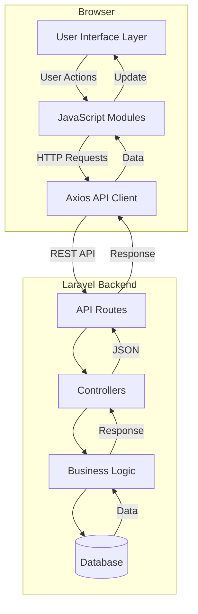

# Design Document: Phase 5 Frontend RBAC Dashboard

## Overview

This design document specifies the frontend architecture for Phase 5 of the FRACA SERVCOM Inventory System. The system provides a complete web-based user interface for inventory management with role-based access control (RBAC), built using HTML5, CSS3/Bootstrap 5, and vanilla JavaScript with Axios for API communication.

### System Context

The frontend application integrates with an existing Laravel backend API that provides:
- RESTful endpoints for all data operations
- Laravel Sanctum authentication with bearer tokens
- Role-based authorization (Admin, Manager, Staff)
- Comprehensive business logic and data validation

### Design Goals

1. **Role-Based UI**: Render interface elements conditionally based on user permissions
2. **Responsive Design**: Support devices from mobile (320px) to desktop (2560px)
3. **Modular Architecture**: Organize code into feature-specific modules for maintainability
4. **Performance**: Optimize loading times through lazy loading, caching, and code splitting
5. **User Experience**: Provide clear feedback through toast notifications and loading states
6. **Security**: Enforce authorization checks on both UI and API layers

### Technology Stack

- **HTML5**: Semantic markup with Laravel Blade templating
- **CSS3/Bootstrap 5**: Responsive styling and component library
- **Vanilla JavaScript (ES6+)**: Client-side logic without framework dependencies
- **Axios**: HTTP client for AJAX requests
- **Vite**: Modern build tool for asset compilation and optimization
- **Laravel Blade**: Server-side templating for initial page rendering


## Architecture

### High-Level Architecture



### Layered Architecture

The frontend follows a three-layer architecture:

1. **Presentation Layer** (Blade Templates + CSS)
   - Server-rendered HTML structure
   - Bootstrap 5 styling and components
   - Role-based conditional rendering with @can directives
   - Responsive layouts using Bootstrap grid system

2. **Application Layer** (JavaScript Modules)
   - Feature-specific modules (products.js, sales.js, etc.)
   - Shared utilities (toast.js, permissions.js, validation.js)
   - Event handling and DOM manipulation
   - Client-side state management

3. **Data Access Layer** (Axios Client)
   - Centralized API communication
   - Request/response interceptors
   - Error handling and retry logic
   - CSRF token management


### Directory Structure

```
resources/
├── views/
│   ├── layouts/
│   │   ├── app.blade.php           # Master layout for authenticated users
│   │   └── guest.blade.php         # Layout for login/register pages
│   ├── dashboard/
│   │   ├── admin.blade.php         # Admin dashboard
│   │   ├── manager.blade.php       # Manager dashboard
│   │   └── staff.blade.php         # Staff dashboard
│   ├── products/
│   │   └── index.blade.php         # Products CRUD interface
│   ├── purchases/
│   │   └── index.blade.php         # Purchases CRUD interface
│   ├── sales/
│   │   └── index.blade.php         # Sales CRUD interface
│   ├── stock-adjustments/
│   │   └── index.blade.php         # Stock adjustments interface
│   ├── reports/
│   │   └── index.blade.php         # Reports interface
│   ├── users/
│   │   └── index.blade.php         # User management interface
│   ├── categories/
│   │   └── index.blade.php         # Categories management
│   ├── suppliers/
│   │   └── index.blade.php         # Suppliers management
│   ├── customers/
│   │   └── index.blade.php         # Customers management
│   └── partials/
│       ├── navbar.blade.php        # Navigation bar
│       ├── footer.blade.php        # Footer
│       ├── toast-container.blade.php  # Toast notification container
│       └── admin-verify-modal.blade.php  # Admin verification modal
├── js/
│   ├── app.js                      # Main entry point
│   ├── api/
│   │   └── client.js               # Axios configuration and API client
│   ├── modules/
│   │   ├── dashboard.js            # Dashboard functionality
│   │   ├── products.js             # Products CRUD logic
│   │   ├── purchases.js            # Purchases CRUD logic
│   │   ├── sales.js                # Sales CRUD logic
│   │   ├── stock-adjustments.js   # Stock adjustments logic
│   │   ├── reports.js              # Reports generation logic
│   │   ├── users.js                # User management logic
│   │   ├── categories.js           # Categories management logic
│   │   ├── suppliers.js            # Suppliers management logic
│   │   └── customers.js            # Customers management logic
│   └── utils/
│       ├── toast.js                # Toast notification system
│       ├── permissions.js          # Permission checking utilities
│       ├── validation.js           # Form validation helpers
│       ├── modal.js                # Modal management utilities
│       ├── table.js                # Table rendering and filtering
│       └── export.js               # CSV export functionality
└── css/
    └── app.css                     # Custom styles and overrides
```


## Components and Interfaces

### 1. Layout Components

#### Master Layout (app.blade.php)

**Purpose**: Provides the base structure for all authenticated pages.

**Structure**:
```html
<!DOCTYPE html>
<html lang="en">
<head>
    <meta charset="UTF-8">
    <meta name="viewport" content="width=device-width, initial-scale=1.0">
    <meta name="csrf-token" content="{{ csrf_token() }}">
    <title>@yield('title') - FRACA SERVCOM Inventory</title>
    @vite(['resources/css/app.css', 'resources/js/app.js'])
</head>
<body>
    @include('partials.navbar')
    
    <main class="container-fluid py-4">
        @yield('content')
    </main>
    
    @include('partials.footer')
    @include('partials.toast-container')
    
    <script>
        window.user = @json(auth()->user());
        window.permissions = @json(auth()->user()->getAllPermissions()->pluck('name'));
    </script>
</body>
</html>
```

**Key Features**:
- CSRF token meta tag for Axios configuration
- Vite asset loading for CSS and JavaScript
- User and permissions data passed to JavaScript via window object
- Includes navbar, footer, and toast container partials

#### Guest Layout (guest.blade.php)

**Purpose**: Provides structure for unauthenticated pages (login, register).

**Structure**: Similar to master layout but without navbar and with centered content area.

#### Navigation Bar (navbar.blade.php)

**Purpose**: Provides site navigation with role-based menu items.

**Structure**:
```html
<nav class="navbar navbar-expand-lg navbar-dark bg-dark">
    <div class="container-fluid">
        <a class="navbar-brand" href="{{ route('dashboard') }}">FRACA SERVCOM</a>
        <button class="navbar-toggler" type="button" data-bs-toggle="collapse" 
                data-bs-target="#navbarNav">
            <span class="navbar-toggler-icon"></span>
        </button>
        <div class="collapse navbar-collapse" id="navbarNav">
            <ul class="navbar-nav me-auto">
                <li class="nav-item">
                    <a class="nav-link" href="{{ route('dashboard') }}">Dashboard</a>
                </li>
                @can('view products')
                <li class="nav-item">
                    <a class="nav-link" href="{{ route('products.index') }}">Products</a>
                </li>
                @endcan
                @can('view purchases')
                <li class="nav-item">
                    <a class="nav-link" href="{{ route('purchases.index') }}">Purchases</a>
                </li>
                @endcan
                @can('view sales')
                <li class="nav-item">
                    <a class="nav-link" href="{{ route('sales.index') }}">Sales</a>
                </li>
                @endcan
                @can('manage stock')
                <li class="nav-item">
                    <a class="nav-link" href="{{ route('stock-adjustments.index') }}">Stock</a>
                </li>
                @endcan
                @can('view reports')
                <li class="nav-item">
                    <a class="nav-link" href="{{ route('reports.index') }}">Reports</a>
                </li>
                @endcan
                @can('manage users')
                <li class="nav-item">
                    <a class="nav-link" href="{{ route('users.index') }}">Users</a>
                </li>
                @endcan
            </ul>
            <ul class="navbar-nav">
                <li class="nav-item dropdown">
                    <a class="nav-link dropdown-toggle" href="#" id="userDropdown" 
                       data-bs-toggle="dropdown">
                        {{ auth()->user()->name }}
                    </a>
                    <ul class="dropdown-menu dropdown-menu-end">
                        <li><a class="dropdown-item" href="{{ route('profile') }}">Profile</a></li>
                        <li><hr class="dropdown-divider"></li>
                        <li>
                            <form action="{{ route('logout') }}" method="POST">
                                @csrf
                                <button type="submit" class="dropdown-item">Logout</button>
                            </form>
                        </li>
                    </ul>
                </li>
            </ul>
        </div>
    </div>
</nav>
```

**Responsive Behavior**:
- Collapses to hamburger menu on screens < 992px
- Dropdown menus for user actions
- Role-based menu items using @can directives

#### Footer (footer.blade.php)

**Purpose**: Displays copyright and branding information.

**Structure**:
```html
<footer class="footer mt-auto py-3 bg-primary text-white sticky-bottom">
    <div class="container-fluid text-center">
        <span>© 2025 FRACA SERVCOM. All rights reserved.</span>
    </div>
</footer>
```

**Styling**:
- Blue background (#007bff)
- White text
- Sticky positioning at bottom of viewport
- Centered content


### 2. Dashboard Components

#### Admin Dashboard

**Purpose**: Comprehensive overview for administrators with full system metrics.

**Layout Structure**:
```
+----------------------------------------------------------+
|  Statistics Cards (4 columns)                            |
|  [Total Products] [Today's Sales] [Low Stock] [Users]    |
+----------------------------------------------------------+
|  Monthly Performance (4 columns)                         |
|  [Sales Total] [Purchase Total] [Profit] [vs Target]    |
+----------------------------------------------------------+
|  Inventory Health (4 columns)                            |
|  [Out of Stock] [Overstock] [Turnover] [Valuation]      |
+----------------------------------------------------------+
|  Operational Metrics (4 columns)                         |
|  [Pending Sales] [Pending Purchases] [Alerts] [Adjusts] |
+----------------------------------------------------------+
|  Quick Actions Grid (4 columns x 3 rows)                 |
|  [Add Product] [Adjust Stock] [Add Category] [Alerts]   |
|  [New Sale] [New Purchase] [Payment] [Return]           |
|  [Add Customer] [Add Supplier] [Add User] [Reports]     |
+----------------------------------------------------------+
|  Activity Timeline (6 col) | Top Performers (6 col)      |
+----------------------------------------------------------+
|  Financial Summary (6 col) | Pending Actions (6 col)     |
+----------------------------------------------------------+
```

**Data Fetching**:
- API Endpoint: `GET /api/dashboard/stats`
- Refresh interval: 30 seconds (configurable)
- Loading state: Skeleton loaders for each widget

**Widget Specifications**:

1. **Statistics Cards**: Display key metrics with icon, value, and label
   - Total Products: Count of all products
   - Today's Sales: Sum of completed sales today
   - Low Stock Items: Count of products at or below reorder level
   - Total Users: Count of active users

2. **Monthly Performance**: Financial metrics for current month
   - Monthly Sales Total: Sum of all sales
   - Monthly Purchase Total: Sum of all purchases
   - Profit Margin: (Sales - Purchases) / Sales * 100
   - Sales vs Target: Progress bar showing percentage of target

3. **Inventory Health**: Stock status indicators
   - Out of Stock: Count of products with zero quantity
   - Overstock: Count of products exceeding threshold
   - Stock Turnover: Sales / Average Inventory
   - Inventory Valuation: Sum of (quantity * unit_price) for all products

4. **Operational Metrics**: Pending items requiring attention
   - Pending Sales: Count of sales with status 'pending'
   - Pending Purchases: Count of purchases with status 'pending'
   - Active Alerts: Count of low stock and other alerts
   - Recent Adjustments: Count of stock adjustments in last 7 days

5. **Quick Actions Grid**: Buttons for common operations
   - Each button navigates to feature page or opens modal
   - Icons from Bootstrap Icons
   - Red background for primary actions, black for secondary

6. **Activity Timeline**: Recent system events
   - Display last 10 events
   - Format: timestamp, user, action, entity
   - Auto-scroll for long lists

7. **Top Performers**: Users ranked by sales volume
   - Display top 5 users
   - Show user name, sales count, total amount
   - Sortable by different metrics

8. **Financial Summary**: Current month financial overview
   - Revenue: Total sales amount
   - Expenses: Total purchase amount
   - Profit: Revenue - Expenses
   - Visual chart (optional)

9. **Pending Actions**: Items requiring attention
   - Low stock products
   - Pending approvals
   - Overdue tasks
   - Clickable to navigate to detail

#### Manager Dashboard

**Purpose**: Team-focused dashboard for operational management.

**Differences from Admin Dashboard**:
- Includes all widgets from Admin Dashboard
- Additional Team Performance Widget:
  - Active Staff count
  - Sales by User breakdown (table or chart)
  - Recent Activity by staff member
- Additional Alerts & Notifications Widget:
  - Low stock warnings
  - System alerts
  - Pending approvals

**Layout**: Similar to Admin Dashboard with additional widgets in bottom section.

#### Staff Dashboard

**Purpose**: Simplified dashboard for daily transaction processing.

**Layout Structure**:
```
+----------------------------------------------------------+
|  Statistics Cards (3 columns)                            |
|  [Total Products] [Today's Sales] [Low Stock Items]      |
+----------------------------------------------------------+
|  Quick Actions (3 columns)                               |
|  [New Sale] [New Purchase] [View Products]              |
+----------------------------------------------------------+
|  Recent Transactions (full width)                        |
|  Table showing last 10 sales and purchases               |
+----------------------------------------------------------+
```

**Restrictions**:
- No user management widgets
- No reports access
- No administrative metrics
- Focus on transaction processing


### 3. CRUD Interface Components

#### Generic CRUD Interface Pattern

All CRUD interfaces (Products, Purchases, Sales, Categories, Suppliers, Customers, Users) follow a consistent pattern:

**Layout Structure**:
```
+----------------------------------------------------------+
|  Page Header with Title and Add Button                   |
+----------------------------------------------------------+
|  Filters and Search Bar                                  |
|  [Search Input] [Category Filter] [Status Filter] etc.   |
+----------------------------------------------------------+
|  Data Table                                              |
|  | Column 1 | Column 2 | Column 3 | ... | Actions |     |
|  |----------|----------|----------|-----|---------|     |
|  | Data     | Data     | Data     | ... | Buttons |     |
+----------------------------------------------------------+
|  Pagination Controls                                     |
+----------------------------------------------------------+
```

**Common Features**:
1. Search input with debounced filtering (300ms delay)
2. Dropdown filters for related entities
3. Sortable table columns
4. Action buttons: View, Edit, Delete (role-based)
5. Pagination for datasets > 50 records
6. Loading states during data fetch
7. Empty state message when no data

#### Products CRUD Interface

**Table Columns**:
- SKU
- Name
- Category (with link to category)
- Quantity (with color coding: red if low stock)
- Unit Price (formatted as currency)
- Actions (View, Edit, Delete)

**Filters**:
- Search by name or SKU
- Category dropdown
- Supplier dropdown
- Low stock toggle

**Add/Edit Modal Structure**:
```html
<div class="modal" id="productModal">
    <div class="modal-dialog modal-lg">
        <div class="modal-content">
            <div class="modal-header">
                <h5 class="modal-title">Add/Edit Product</h5>
                <button type="button" class="btn-close" data-bs-dismiss="modal"></button>
            </div>
            <div class="modal-body">
                <form id="productForm">
                    <div class="row">
                        <div class="col-md-6">
                            <label>Name *</label>
                            <input type="text" name="name" class="form-control" required>
                            <div class="invalid-feedback"></div>
                        </div>
                        <div class="col-md-6">
                            <label>SKU *</label>
                            <input type="text" name="sku" class="form-control" required>
                            <div class="invalid-feedback"></div>
                        </div>
                    </div>
                    <div class="row">
                        <div class="col-md-6">
                            <label>Category *</label>
                            <select name="category_id" class="form-select" required>
                                <option value="">Select Category</option>
                            </select>
                            <div class="invalid-feedback"></div>
                        </div>
                        <div class="col-md-6">
                            <label>Supplier *</label>
                            <select name="supplier_id" class="form-select" required>
                                <option value="">Select Supplier</option>
                            </select>
                            <div class="invalid-feedback"></div>
                        </div>
                    </div>
                    <div class="row">
                        <div class="col-md-4">
                            <label>Unit Price *</label>
                            <input type="number" name="unit_price" class="form-control" 
                                   step="0.01" min="0" required>
                            <div class="invalid-feedback"></div>
                        </div>
                        <div class="col-md-4">
                            <label>Quantity *</label>
                            <input type="number" name="current_stock" class="form-control" 
                                   min="0" required>
                            <div class="invalid-feedback"></div>
                        </div>
                        <div class="col-md-4">
                            <label>Reorder Level *</label>
                            <input type="number" name="reorder_level" class="form-control" 
                                   min="0" required>
                            <div class="invalid-feedback"></div>
                        </div>
                    </div>
                    <div class="row">
                        <div class="col-12">
                            <label>Description</label>
                            <textarea name="description" class="form-control" rows="3"></textarea>
                        </div>
                    </div>
                </form>
            </div>
            <div class="modal-footer">
                <button type="button" class="btn btn-secondary" data-bs-dismiss="modal">
                    Cancel
                </button>
                <button type="button" class="btn btn-danger" id="saveProductBtn">
                    <span class="spinner-border spinner-border-sm d-none" role="status"></span>
                    Save Product
                </button>
            </div>
        </div>
    </div>
</div>
```

**Form Validation**:
- Client-side validation using HTML5 attributes
- Server-side validation errors displayed inline
- Required fields marked with asterisk
- Invalid feedback div below each input

**Delete Workflow**:
- Admin: Confirmation modal → DELETE request
- Manager: Admin verification modal → DELETE request
- Staff: No delete button visible


#### Purchases and Sales CRUD Interface

**Special Features**: Dynamic line items with product selection and automatic calculation.

**Table Columns** (Purchases):
- Purchase Number
- Supplier
- Date
- Total Amount (formatted as currency)
- Status (badge with color coding)
- Actions (View, Edit, Delete)

**Table Columns** (Sales):
- Invoice Number
- Customer
- Date
- Total Amount (formatted as currency)
- Status (badge with color coding)
- Actions (View, Edit, Delete)

**Add/Edit Modal Structure** (with dynamic line items):
```html
<div class="modal" id="purchaseModal">
    <div class="modal-dialog modal-xl">
        <div class="modal-content">
            <div class="modal-header">
                <h5 class="modal-title">Add/Edit Purchase</h5>
                <button type="button" class="btn-close" data-bs-dismiss="modal"></button>
            </div>
            <div class="modal-body">
                <form id="purchaseForm">
                    <!-- Header Section -->
                    <div class="row mb-3">
                        <div class="col-md-4">
                            <label>Supplier *</label>
                            <select name="supplier_id" class="form-select" required>
                                <option value="">Select Supplier</option>
                            </select>
                            <div class="invalid-feedback"></div>
                        </div>
                        <div class="col-md-4">
                            <label>Purchase Date *</label>
                            <input type="date" name="purchase_date" class="form-control" required>
                            <div class="invalid-feedback"></div>
                        </div>
                        <div class="col-md-4">
                            <label>Status *</label>
                            <select name="status" class="form-select" required>
                                <option value="pending">Pending</option>
                                <option value="completed">Completed</option>
                                <option value="cancelled">Cancelled</option>
                            </select>
                            <div class="invalid-feedback"></div>
                        </div>
                    </div>
                    
                    <!-- Line Items Section -->
                    <div class="mb-3">
                        <div class="d-flex justify-content-between align-items-center mb-2">
                            <h6>Products</h6>
                            <button type="button" class="btn btn-sm btn-secondary" 
                                    id="addProductRow">
                                + Add Product
                            </button>
                        </div>
                        <div class="table-responsive">
                            <table class="table table-bordered" id="productItemsTable">
                                <thead>
                                    <tr>
                                        <th width="40%">Product</th>
                                        <th width="15%">Quantity</th>
                                        <th width="20%">Unit Price</th>
                                        <th width="20%">Subtotal</th>
                                        <th width="5%"></th>
                                    </tr>
                                </thead>
                                <tbody id="productItemsBody">
                                    <!-- Dynamic rows added here -->
                                </tbody>
                                <tfoot>
                                    <tr>
                                        <td colspan="3" class="text-end"><strong>Total:</strong></td>
                                        <td><strong id="totalAmount">$0.00</strong></td>
                                        <td></td>
                                    </tr>
                                </tfoot>
                            </table>
                        </div>
                    </div>
                    
                    <!-- Notes Section -->
                    <div class="row">
                        <div class="col-12">
                            <label>Notes</label>
                            <textarea name="notes" class="form-control" rows="2"></textarea>
                        </div>
                    </div>
                </form>
            </div>
            <div class="modal-footer">
                <button type="button" class="btn btn-secondary" data-bs-dismiss="modal">
                    Cancel
                </button>
                <button type="button" class="btn btn-danger" id="savePurchaseBtn">
                    <span class="spinner-border spinner-border-sm d-none"></span>
                    Save Purchase
                </button>
            </div>
        </div>
    </div>
</div>
```

**Dynamic Line Item Row Template**:
```html
<tr class="product-item-row">
    <td>
        <select name="items[{index}][product_id]" class="form-select product-select" required>
            <option value="">Select Product</option>
        </select>
    </td>
    <td>
        <input type="number" name="items[{index}][quantity]" 
               class="form-control quantity-input" min="1" required>
    </td>
    <td>
        <input type="number" name="items[{index}][unit_price]" 
               class="form-control price-input" step="0.01" min="0" required>
    </td>
    <td>
        <input type="text" class="form-control subtotal-display" readonly>
    </td>
    <td>
        <button type="button" class="btn btn-sm btn-danger remove-row">×</button>
    </td>
</tr>
```

**Calculation Logic**:
- Subtotal = Quantity × Unit Price
- Total = Sum of all subtotals
- Recalculate on any quantity or price change
- Update total display in real-time

**View Modal** (Read-only):
- Display purchase/sale header information
- Display line items in read-only table
- Show calculated totals
- No edit capabilities


#### Stock Adjustments Interface

**Purpose**: Allow authorized users to manually adjust inventory quantities.

**Layout Structure**:
```
+----------------------------------------------------------+
|  Adjustment Form (top section)                           |
+----------------------------------------------------------+
|  Recent Adjustments Table (bottom section)               |
+----------------------------------------------------------+
```

**Adjustment Form**:
```html
<form id="stockAdjustmentForm" class="card p-4 mb-4">
    <h5 class="mb-3">Record Stock Adjustment</h5>
    <div class="row">
        <div class="col-md-3">
            <label>Product *</label>
            <select name="product_id" class="form-select" required>
                <option value="">Select Product</option>
            </select>
            <div class="invalid-feedback"></div>
        </div>
        <div class="col-md-2">
            <label>Type *</label>
            <select name="type" class="form-select" required>
                <option value="adjustment">Adjustment</option>
                <option value="damage">Damage</option>
                <option value="return">Return</option>
            </select>
            <div class="invalid-feedback"></div>
        </div>
        <div class="col-md-2">
            <label>Quantity Change *</label>
            <input type="number" name="quantity_change" class="form-control" required>
            <small class="text-muted">Use negative for decrease</small>
            <div class="invalid-feedback"></div>
        </div>
        <div class="col-md-5">
            <label>Reason *</label>
            <textarea name="reason" class="form-control" rows="1" required></textarea>
            <div class="invalid-feedback"></div>
        </div>
    </div>
    <div class="row mt-3">
        <div class="col-12">
            <button type="submit" class="btn btn-danger">
                <span class="spinner-border spinner-border-sm d-none"></span>
                Record Adjustment
            </button>
            <button type="reset" class="btn btn-secondary">Clear</button>
        </div>
    </div>
</form>
```

**Recent Adjustments Table**:
- Columns: Date, Product, Type, Quantity Change, Reason, User
- Display last 20 adjustments
- Color coding: green for increases, red for decreases
- No edit or delete capabilities (audit trail)

#### Reports Interface

**Purpose**: Generate and export business reports with filtering.

**Layout Structure**:
```
+----------------------------------------------------------+
|  Report Type Tabs                                        |
|  [Inventory] [Sales] [Profit/Loss] [Stock Movement]     |
+----------------------------------------------------------+
|  Filter Controls (dynamic based on report type)          |
+----------------------------------------------------------+
|  Generate Button and Export Button                       |
+----------------------------------------------------------+
|  Report Results Table                                    |
+----------------------------------------------------------+
```

**Report Types and Filters**:

1. **Inventory Valuation Report**
   - Filters: Category, Supplier
   - Columns: Product, Category, Quantity, Unit Cost, Total Value
   - API: `GET /api/reports/inventory-valuation`

2. **Sales by Period Report**
   - Filters: Date Range, Customer, Category
   - Columns: Date, Product, Quantity Sold, Revenue, Profit
   - API: `GET /api/reports/sales`

3. **Profit/Loss Report**
   - Filters: Date Range, Group By (day/week/month)
   - Columns: Period, Revenue, COGS, Gross Profit, Expenses, Net Profit
   - API: `GET /api/reports/profit-loss`

4. **Stock Movement Report**
   - Filters: Date Range, Product, Category
   - Columns: Product, Opening Stock, Purchases, Sales, Adjustments, Closing Stock
   - API: `GET /api/reports/stock-movement`

**Export Functionality**:
```javascript
function exportToCSV(tableId, filename) {
    const table = document.getElementById(tableId);
    const rows = Array.from(table.querySelectorAll('tr'));
    
    const csv = rows.map(row => {
        const cells = Array.from(row.querySelectorAll('th, td'));
        return cells.map(cell => {
            const text = cell.textContent.trim();
            return `"${text.replace(/"/g, '""')}"`;
        }).join(',');
    }).join('\n');
    
    const blob = new Blob([csv], { type: 'text/csv' });
    const url = URL.createObjectURL(blob);
    const link = document.createElement('a');
    link.href = url;
    link.download = `${filename}_${new Date().toISOString().split('T')[0]}.csv`;
    link.click();
    URL.revokeObjectURL(url);
}
```


### 4. Shared Components

#### Toast Notification System

**Purpose**: Provide consistent user feedback for all operations.

**Container Structure** (toast-container.blade.php):
```html
<div class="toast-container position-fixed top-0 end-0 p-3" id="toastContainer">
    <!-- Toasts dynamically inserted here -->
</div>
```

**Toast Template**:
```html
<div class="toast align-items-center text-white bg-{type} border-0" role="alert">
    <div class="d-flex">
        <div class="toast-body">
            {message}
        </div>
        <button type="button" class="btn-close btn-close-white me-2 m-auto" 
                data-bs-dismiss="toast"></button>
    </div>
</div>
```

**JavaScript Implementation** (utils/toast.js):
```javascript
export function showToast(message, type = 'info') {
    const toastContainer = document.getElementById('toastContainer');
    
    // Map type to Bootstrap color classes
    const colorMap = {
        success: 'bg-success',
        error: 'bg-danger',
        warning: 'bg-warning',
        info: 'bg-info'
    };
    
    const toastEl = document.createElement('div');
    toastEl.className = `toast align-items-center text-white ${colorMap[type]} border-0`;
    toastEl.setAttribute('role', 'alert');
    toastEl.setAttribute('aria-live', 'assertive');
    toastEl.setAttribute('aria-atomic', 'true');
    
    toastEl.innerHTML = `
        <div class="d-flex">
            <div class="toast-body">${message}</div>
            <button type="button" class="btn-close btn-close-white me-2 m-auto" 
                    data-bs-dismiss="toast"></button>
        </div>
    `;
    
    toastContainer.appendChild(toastEl);
    
    const toast = new bootstrap.Toast(toastEl, {
        autohide: true,
        delay: 5000
    });
    
    toast.show();
    
    // Remove from DOM after hidden
    toastEl.addEventListener('hidden.bs.toast', () => {
        toastEl.remove();
    });
}
```

**Usage Examples**:
```javascript
showToast('Product created successfully', 'success');
showToast('Failed to delete product', 'error');
showToast('Low stock alert', 'warning');
showToast('Data loaded', 'info');
```

#### Admin Verification Modal

**Purpose**: Require admin credentials for manager delete operations.

**Structure** (admin-verify-modal.blade.php):
```html
<div class="modal fade" id="adminVerifyModal" tabindex="-1" data-bs-backdrop="static">
    <div class="modal-dialog">
        <div class="modal-content">
            <div class="modal-header">
                <h5 class="modal-title">Admin Verification Required</h5>
                <button type="button" class="btn-close" data-bs-dismiss="modal"></button>
            </div>
            <div class="modal-body">
                <p class="text-muted">
                    This action requires administrator credentials. 
                    Please enter an admin email and password to continue.
                </p>
                <form id="adminVerifyForm">
                    <div class="mb-3">
                        <label>Admin Email *</label>
                        <input type="email" name="admin_email" class="form-control" 
                               required autocomplete="off">
                        <div class="invalid-feedback"></div>
                    </div>
                    <div class="mb-3">
                        <label>Admin Password *</label>
                        <input type="password" name="admin_password" class="form-control" 
                               required autocomplete="off">
                        <div class="invalid-feedback"></div>
                    </div>
                </form>
            </div>
            <div class="modal-footer">
                <button type="button" class="btn btn-secondary" data-bs-dismiss="modal">
                    Cancel
                </button>
                <button type="button" class="btn btn-danger" id="verifyAdminBtn">
                    <span class="spinner-border spinner-border-sm d-none"></span>
                    Verify and Continue
                </button>
            </div>
        </div>
    </div>
</div>
```

**JavaScript Implementation** (utils/modal.js):
```javascript
export function showAdminVerifyModal(onVerified) {
    const modal = new bootstrap.Modal(document.getElementById('adminVerifyModal'));
    const form = document.getElementById('adminVerifyForm');
    const verifyBtn = document.getElementById('verifyAdminBtn');
    
    // Reset form
    form.reset();
    form.querySelectorAll('.is-invalid').forEach(el => el.classList.remove('is-invalid'));
    
    // Show modal
    modal.show();
    
    // Handle verification
    verifyBtn.onclick = async () => {
        const formData = new FormData(form);
        const spinner = verifyBtn.querySelector('.spinner-border');
        
        try {
            spinner.classList.remove('d-none');
            verifyBtn.disabled = true;
            
            const response = await apiClient.post('/api/verify-admin', {
                email: formData.get('admin_email'),
                password: formData.get('admin_password')
            });
            
            if (response.data.success) {
                modal.hide();
                onVerified();
            }
        } catch (error) {
            if (error.response?.status === 401) {
                showToast('Invalid admin credentials', 'error');
            } else {
                showToast('Verification failed', 'error');
            }
        } finally {
            spinner.classList.add('d-none');
            verifyBtn.disabled = false;
        }
    };
}
```

**Usage Example**:
```javascript
// In delete handler for manager users
if (userRole === 'Manager') {
    showAdminVerifyModal(() => {
        // Proceed with delete after verification
        deleteProduct(productId);
    });
} else {
    // Admin can delete directly
    confirmDelete(() => deleteProduct(productId));
}
```


## Data Models

### Frontend Data Structures

The frontend works with JSON data structures received from the API. These are TypeScript-style interfaces for documentation purposes (actual implementation uses vanilla JavaScript).

#### Product
```typescript
interface Product {
    id: number;
    name: string;
    sku: string;
    barcode?: string;
    category_id: number;
    category?: Category;
    supplier_id: number;
    supplier?: Supplier;
    unit_price: number;
    selling_price: number;
    current_stock: number;
    reorder_level: number;
    description?: string;
    created_at: string;
    updated_at: string;
}
```

#### Purchase
```typescript
interface Purchase {
    id: number;
    purchase_number: string;
    supplier_id: number;
    supplier?: Supplier;
    purchase_date: string;
    total_amount: number;
    status: 'pending' | 'completed' | 'cancelled';
    payment_method?: string;
    notes?: string;
    items: PurchaseItem[];
    created_at: string;
    updated_at: string;
}

interface PurchaseItem {
    id: number;
    purchase_id: number;
    product_id: number;
    product?: Product;
    quantity: number;
    unit_price: number;
    subtotal: number;
}
```

#### Sale
```typescript
interface Sale {
    id: number;
    invoice_number: string;
    customer_id: number;
    customer?: Customer;
    sale_date: string;
    total_amount: number;
    status: 'pending' | 'completed' | 'cancelled';
    payment_method?: string;
    notes?: string;
    items: SaleItem[];
    created_at: string;
    updated_at: string;
}

interface SaleItem {
    id: number;
    sale_id: number;
    product_id: number;
    product?: Product;
    quantity: number;
    unit_price: number;
    subtotal: number;
}
```

#### Stock Adjustment
```typescript
interface StockAdjustment {
    id: number;
    product_id: number;
    product?: Product;
    quantity_change: number;
    type: 'adjustment' | 'damage' | 'return';
    reason: string;
    notes?: string;
    previous_stock: number;
    new_stock: number;
    user_id: number;
    user?: User;
    created_at: string;
}
```

#### User
```typescript
interface User {
    id: number;
    name: string;
    email: string;
    role: 'Admin' | 'Manager' | 'Staff';
    status: 'active' | 'inactive';
    created_at: string;
    updated_at: string;
}
```

#### Category
```typescript
interface Category {
    id: number;
    name: string;
    description?: string;
    products_count?: number;
    created_at: string;
    updated_at: string;
}
```

#### Supplier
```typescript
interface Supplier {
    id: number;
    name: string;
    email?: string;
    phone?: string;
    address?: string;
    city?: string;
    country?: string;
    tax_number?: string;
    is_active: boolean;
    notes?: string;
    created_at: string;
    updated_at: string;
}
```

#### Customer
```typescript
interface Customer {
    id: number;
    first_name: string;
    last_name: string;
    email?: string;
    phone?: string;
    address?: string;
    city?: string;
    country?: string;
    is_active: boolean;
    notes?: string;
    total_purchases?: number;
    created_at: string;
    updated_at: string;
}
```

#### Dashboard Statistics
```typescript
interface DashboardStats {
    total_products: number;
    todays_sales: number;
    low_stock_items: number;
    total_users: number;
    monthly_sales_total: number;
    monthly_purchase_total: number;
    profit_margin: number;
    sales_vs_target: number;
    out_of_stock: number;
    overstock: number;
    stock_turnover: number;
    inventory_valuation: number;
    pending_sales: number;
    pending_purchases: number;
    active_alerts: number;
    recent_adjustments: number;
    recent_activities: Activity[];
    top_performers: UserPerformance[];
    financial_summary: FinancialSummary;
    pending_actions: PendingAction[];
}

interface Activity {
    id: number;
    user: string;
    action: string;
    entity: string;
    timestamp: string;
}

interface UserPerformance {
    user_id: number;
    user_name: string;
    sales_count: number;
    total_amount: number;
}

interface FinancialSummary {
    revenue: number;
    expenses: number;
    profit: number;
}

interface PendingAction {
    type: string;
    description: string;
    link: string;
}
```

### API Response Format

All API responses follow this standard format:

```typescript
interface ApiResponse<T> {
    success: boolean;
    message: string;
    data?: T;
    errors?: Record<string, string[]>;
}

interface PaginatedResponse<T> {
    success: boolean;
    message: string;
    data: {
        current_page: number;
        data: T[];
        total: number;
        per_page: number;
        last_page: number;
    };
}
```


## JavaScript Module Patterns and Event Handling

### Module Structure Pattern

Each feature module follows this pattern:

```javascript
// modules/products.js
import { apiClient } from '../api/client.js';
import { showToast } from '../utils/toast.js';
import { showAdminVerifyModal } from '../utils/modal.js';
import { hasPermission } from '../utils/permissions.js';

class ProductsModule {
    constructor() {
        this.currentPage = 1;
        this.filters = {
            search: '',
            category_id: '',
            supplier_id: ''
        };
        this.products = [];
    }
    
    init() {
        this.bindEvents();
        this.loadProducts();
        this.loadCategories();
        this.loadSuppliers();
    }
    
    bindEvents() {
        // Search with debounce
        const searchInput = document.getElementById('searchInput');
        if (searchInput) {
            searchInput.addEventListener('input', this.debounce((e) => {
                this.filters.search = e.target.value;
                this.loadProducts();
            }, 300));
        }
        
        // Filter dropdowns
        document.getElementById('categoryFilter')?.addEventListener('change', (e) => {
            this.filters.category_id = e.target.value;
            this.loadProducts();
        });
        
        // Add button
        document.getElementById('addProductBtn')?.addEventListener('click', () => {
            this.showProductModal();
        });
        
        // Form submission
        document.getElementById('saveProductBtn')?.addEventListener('click', () => {
            this.saveProduct();
        });
        
        // Table event delegation for edit/delete
        document.getElementById('productsTable')?.addEventListener('click', (e) => {
            if (e.target.classList.contains('edit-btn')) {
                const productId = e.target.dataset.id;
                this.editProduct(productId);
            } else if (e.target.classList.contains('delete-btn')) {
                const productId = e.target.dataset.id;
                this.deleteProduct(productId);
            }
        });
    }
    
    async loadProducts() {
        try {
            this.showLoading();
            const response = await apiClient.get('/api/products', {
                params: {
                    ...this.filters,
                    page: this.currentPage
                }
            });
            
            this.products = response.data.data.data;
            this.renderTable();
            this.renderPagination(response.data.data);
        } catch (error) {
            showToast('Failed to load products', 'error');
        } finally {
            this.hideLoading();
        }
    }
    
    renderTable() {
        const tbody = document.getElementById('productsTableBody');
        if (!tbody) return;
        
        tbody.innerHTML = this.products.map(product => `
            <tr>
                <td>${product.sku}</td>
                <td>${product.name}</td>
                <td>${product.category?.name || '-'}</td>
                <td class="${product.current_stock <= product.reorder_level ? 'text-danger' : ''}">
                    ${product.current_stock}
                </td>
                <td>$${parseFloat(product.unit_price).toFixed(2)}</td>
                <td>
                    <button class="btn btn-sm btn-info view-btn" data-id="${product.id}">
                        View
                    </button>
                    ${hasPermission('edit products') ? `
                        <button class="btn btn-sm btn-warning edit-btn" data-id="${product.id}">
                            Edit
                        </button>
                    ` : ''}
                    ${hasPermission('delete products') ? `
                        <button class="btn btn-sm btn-danger delete-btn" data-id="${product.id}">
                            Delete
                        </button>
                    ` : ''}
                </td>
            </tr>
        `).join('');
    }
    
    showProductModal(product = null) {
        const modal = new bootstrap.Modal(document.getElementById('productModal'));
        const form = document.getElementById('productForm');
        
        // Reset form
        form.reset();
        form.querySelectorAll('.is-invalid').forEach(el => el.classList.remove('is-invalid'));
        
        // Populate if editing
        if (product) {
            Object.keys(product).forEach(key => {
                const input = form.elements[key];
                if (input) input.value = product[key];
            });
        }
        
        modal.show();
    }
    
    async saveProduct() {
        const form = document.getElementById('productForm');
        const formData = new FormData(form);
        const data = Object.fromEntries(formData);
        const productId = form.dataset.productId;
        
        try {
            const spinner = document.querySelector('#saveProductBtn .spinner-border');
            spinner.classList.remove('d-none');
            
            const response = productId
                ? await apiClient.put(`/api/products/${productId}`, data)
                : await apiClient.post('/api/products', data);
            
            showToast(response.data.message, 'success');
            bootstrap.Modal.getInstance(document.getElementById('productModal')).hide();
            this.loadProducts();
        } catch (error) {
            if (error.response?.status === 422) {
                this.displayValidationErrors(error.response.data.errors);
            } else {
                showToast('Failed to save product', 'error');
            }
        } finally {
            document.querySelector('#saveProductBtn .spinner-border').classList.add('d-none');
        }
    }
    
    async deleteProduct(productId) {
        const userRole = window.user?.role;
        
        if (userRole === 'Manager') {
            showAdminVerifyModal(async () => {
                await this.performDelete(productId);
            });
        } else {
            if (confirm('Are you sure you want to delete this product?')) {
                await this.performDelete(productId);
            }
        }
    }
    
    async performDelete(productId) {
        try {
            const response = await apiClient.delete(`/api/products/${productId}`);
            showToast(response.data.message, 'success');
            this.loadProducts();
        } catch (error) {
            showToast('Failed to delete product', 'error');
        }
    }
    
    displayValidationErrors(errors) {
        Object.keys(errors).forEach(field => {
            const input = document.querySelector(`[name="${field}"]`);
            if (input) {
                input.classList.add('is-invalid');
                const feedback = input.nextElementSibling;
                if (feedback && feedback.classList.contains('invalid-feedback')) {
                    feedback.textContent = errors[field][0];
                }
            }
        });
    }
    
    debounce(func, wait) {
        let timeout;
        return function executedFunction(...args) {
            const later = () => {
                clearTimeout(timeout);
                func(...args);
            };
            clearTimeout(timeout);
            timeout = setTimeout(later, wait);
        };
    }
    
    showLoading() {
        document.getElementById('loadingSpinner')?.classList.remove('d-none');
    }
    
    hideLoading() {
        document.getElementById('loadingSpinner')?.classList.add('d-none');
    }
}

// Initialize when DOM is ready
document.addEventListener('DOMContentLoaded', () => {
    if (document.getElementById('productsPage')) {
        const productsModule = new ProductsModule();
        productsModule.init();
    }
});

export default ProductsModule;
```

### Event Handling Patterns

#### 1. Event Delegation for Dynamic Content

Use event delegation for table rows and dynamic elements:

```javascript
// Instead of binding to each button
document.getElementById('productsTable').addEventListener('click', (e) => {
    if (e.target.matches('.edit-btn')) {
        handleEdit(e.target.dataset.id);
    }
});
```

#### 2. Debounced Search Input

Prevent excessive API calls during typing:

```javascript
const debounce = (func, wait) => {
    let timeout;
    return (...args) => {
        clearTimeout(timeout);
        timeout = setTimeout(() => func(...args), wait);
    };
};

searchInput.addEventListener('input', debounce((e) => {
    performSearch(e.target.value);
}, 300));
```

#### 3. Form Submission Prevention

Prevent default form submission and handle via AJAX:

```javascript
form.addEventListener('submit', (e) => {
    e.preventDefault();
    handleFormSubmit();
});
```

#### 4. Modal Lifecycle Events

Handle modal show/hide events:

```javascript
const modal = document.getElementById('productModal');
modal.addEventListener('show.bs.modal', () => {
    // Initialize modal content
});

modal.addEventListener('hidden.bs.modal', () => {
    // Cleanup
    form.reset();
});
```


## API Integration Layer

### Axios Client Configuration

**File**: `js/api/client.js`

```javascript
import axios from 'axios';
import { showToast } from '../utils/toast.js';

// Get CSRF token from meta tag
const csrfToken = document.querySelector('meta[name="csrf-token"]')?.getAttribute('content');

// Create Axios instance
const apiClient = axios.create({
    baseURL: '/api',
    headers: {
        'Content-Type': 'application/json',
        'Accept': 'application/json',
        'X-CSRF-TOKEN': csrfToken
    },
    timeout: 30000
});

// Request interceptor
apiClient.interceptors.request.use(
    (config) => {
        // Add auth token if available
        const token = localStorage.getItem('auth_token');
        if (token) {
            config.headers.Authorization = `Bearer ${token}`;
        }
        
        // Show loading indicator for non-GET requests
        if (config.method !== 'get') {
            document.body.classList.add('loading');
        }
        
        return config;
    },
    (error) => {
        return Promise.reject(error);
    }
);

// Response interceptor
apiClient.interceptors.response.use(
    (response) => {
        // Hide loading indicator
        document.body.classList.remove('loading');
        return response;
    },
    (error) => {
        // Hide loading indicator
        document.body.classList.remove('loading');
        
        // Handle different error types
        if (!error.response) {
            // Network error
            showToast('Network error. Please check your connection.', 'error');
        } else {
            switch (error.response.status) {
                case 401:
                    // Unauthorized - redirect to login
                    showToast('Session expired. Please login again.', 'error');
                    setTimeout(() => {
                        window.location.href = '/login';
                    }, 1500);
                    break;
                    
                case 403:
                    // Forbidden
                    showToast('You do not have permission to perform this action.', 'error');
                    break;
                    
                case 404:
                    // Not found
                    showToast('The requested resource was not found.', 'error');
                    break;
                    
                case 422:
                    // Validation error - handled by individual modules
                    break;
                    
                case 500:
                    // Server error
                    showToast('Server error. Please try again later.', 'error');
                    console.error('Server error:', error.response.data);
                    break;
                    
                default:
                    showToast('An error occurred. Please try again.', 'error');
            }
        }
        
        // Log all errors for debugging
        console.error('API Error:', error);
        
        return Promise.reject(error);
    }
);

export { apiClient };
```

### API Service Layer Pattern

For complex API interactions, create service modules:

**File**: `js/api/products-service.js`

```javascript
import { apiClient } from './client.js';

export const ProductsService = {
    async getAll(params = {}) {
        const response = await apiClient.get('/products', { params });
        return response.data;
    },
    
    async getById(id) {
        const response = await apiClient.get(`/products/${id}`);
        return response.data;
    },
    
    async create(data) {
        const response = await apiClient.post('/products', data);
        return response.data;
    },
    
    async update(id, data) {
        const response = await apiClient.put(`/products/${id}`, data);
        return response.data;
    },
    
    async delete(id) {
        const response = await apiClient.delete(`/products/${id}`);
        return response.data;
    },
    
    async getLowStock() {
        const response = await apiClient.get('/products/low-stock');
        return response.data;
    }
};
```

### Caching Strategy

Implement caching for reference data to reduce API calls:

**File**: `js/utils/cache.js`

```javascript
class CacheManager {
    constructor() {
        this.cache = new Map();
        this.ttl = 5 * 60 * 1000; // 5 minutes
    }
    
    set(key, value) {
        this.cache.set(key, {
            value,
            timestamp: Date.now()
        });
    }
    
    get(key) {
        const item = this.cache.get(key);
        if (!item) return null;
        
        // Check if expired
        if (Date.now() - item.timestamp > this.ttl) {
            this.cache.delete(key);
            return null;
        }
        
        return item.value;
    }
    
    clear() {
        this.cache.clear();
    }
    
    delete(key) {
        this.cache.delete(key);
    }
}

export const cache = new CacheManager();
```

**Usage in modules**:

```javascript
async loadCategories() {
    // Check cache first
    let categories = cache.get('categories');
    
    if (!categories) {
        const response = await apiClient.get('/api/categories');
        categories = response.data.data;
        cache.set('categories', categories);
    }
    
    this.renderCategoryDropdown(categories);
}
```

### Request Retry Logic

For critical operations, implement retry logic:

```javascript
async function retryRequest(requestFn, maxRetries = 3, delay = 1000) {
    for (let i = 0; i < maxRetries; i++) {
        try {
            return await requestFn();
        } catch (error) {
            if (i === maxRetries - 1) throw error;
            
            // Don't retry on client errors (4xx)
            if (error.response?.status >= 400 && error.response?.status < 500) {
                throw error;
            }
            
            // Wait before retrying
            await new Promise(resolve => setTimeout(resolve, delay * (i + 1)));
        }
    }
}

// Usage
const data = await retryRequest(() => apiClient.get('/api/critical-data'));
```


## Role-Based Access Control Implementation

### Server-Side Permission Checking (Blade)

Use Laravel's `@can` directive for server-side rendering:

```blade
{{-- Navigation menu items --}}
@can('view products')
    <li class="nav-item">
        <a class="nav-link" href="{{ route('products.index') }}">Products</a>
    </li>
@endcan

@can('manage users')
    <li class="nav-item">
        <a class="nav-link" href="{{ route('users.index') }}">Users</a>
    </li>
@endcan

{{-- Action buttons --}}
@can('create products')
    <button class="btn btn-danger" id="addProductBtn">Add Product</button>
@endcan

@can('delete products')
    <button class="btn btn-danger delete-btn" data-id="{{ $product->id }}">Delete</button>
@endcan
```

### Client-Side Permission Checking (JavaScript)

**File**: `js/utils/permissions.js`

```javascript
class PermissionManager {
    constructor() {
        this.permissions = window.permissions || [];
        this.user = window.user || null;
    }
    
    hasPermission(permission) {
        return this.permissions.includes(permission);
    }
    
    hasAnyPermission(permissions) {
        return permissions.some(p => this.hasPermission(p));
    }
    
    hasAllPermissions(permissions) {
        return permissions.every(p => this.hasPermission(p));
    }
    
    hasRole(role) {
        return this.user?.role === role;
    }
    
    isAdmin() {
        return this.hasRole('Admin');
    }
    
    isManager() {
        return this.hasRole('Manager');
    }
    
    isStaff() {
        return this.hasRole('Staff');
    }
    
    canDelete() {
        // Admin can delete directly, Manager needs verification
        return this.isAdmin() || this.isManager();
    }
}

export const permissions = new PermissionManager();
export const hasPermission = (permission) => permissions.hasPermission(permission);
export const hasRole = (role) => permissions.hasRole(role);
```

**Usage in modules**:

```javascript
import { hasPermission, hasRole } from '../utils/permissions.js';

// Conditional rendering
renderActionButtons(item) {
    let buttons = `<button class="btn btn-sm btn-info view-btn">View</button>`;
    
    if (hasPermission('edit products')) {
        buttons += `<button class="btn btn-sm btn-warning edit-btn">Edit</button>`;
    }
    
    if (hasPermission('delete products')) {
        buttons += `<button class="btn btn-sm btn-danger delete-btn">Delete</button>`;
    }
    
    return buttons;
}

// Conditional API calls
async deleteProduct(id) {
    if (!hasPermission('delete products')) {
        showToast('You do not have permission to delete products', 'error');
        return;
    }
    
    if (hasRole('Manager')) {
        // Require admin verification
        showAdminVerifyModal(() => this.performDelete(id));
    } else {
        // Admin can delete directly
        if (confirm('Are you sure?')) {
            this.performDelete(id);
        }
    }
}
```

### Permission-Based UI Initialization

Initialize different UI components based on role:

```javascript
// In dashboard.js
class DashboardModule {
    init() {
        const role = window.user?.role;
        
        switch (role) {
            case 'Admin':
                this.initAdminDashboard();
                break;
            case 'Manager':
                this.initManagerDashboard();
                break;
            case 'Staff':
                this.initStaffDashboard();
                break;
        }
    }
    
    initAdminDashboard() {
        this.loadAllStatistics();
        this.loadQuickActions();
        this.loadActivityTimeline();
        this.loadTopPerformers();
        this.loadFinancialSummary();
        this.loadPendingActions();
    }
    
    initManagerDashboard() {
        this.loadAllStatistics();
        this.loadQuickActions();
        this.loadActivityTimeline();
        this.loadTopPerformers();
        this.loadFinancialSummary();
        this.loadPendingActions();
        this.loadTeamPerformance();
        this.loadAlerts();
    }
    
    initStaffDashboard() {
        this.loadBasicStatistics();
        this.loadStaffQuickActions();
        this.loadRecentTransactions();
    }
}
```

### Security Considerations

1. **Never rely solely on client-side checks**: Always enforce permissions on the backend
2. **Hide UI elements**: Don't just disable them - remove them from DOM
3. **Validate on every API call**: Backend must verify permissions
4. **Audit trail**: Log all permission checks and admin verifications
5. **Token management**: Store auth tokens securely, refresh when needed


## State Management

### Local State Management Pattern

Each module manages its own state using class properties:

```javascript
class ProductsModule {
    constructor() {
        // State properties
        this.state = {
            products: [],
            categories: [],
            suppliers: [],
            currentPage: 1,
            totalPages: 1,
            filters: {
                search: '',
                category_id: '',
                supplier_id: '',
                low_stock: false
            },
            loading: false,
            selectedProduct: null
        };
    }
    
    // State update methods
    setState(updates) {
        this.state = { ...this.state, ...updates };
        this.render();
    }
    
    updateFilters(filterUpdates) {
        this.state.filters = { ...this.state.filters, ...filterUpdates };
        this.loadProducts();
    }
    
    setLoading(loading) {
        this.state.loading = loading;
        this.toggleLoadingUI(loading);
    }
}
```

### Global State for Shared Data

For data shared across modules, use a simple global state manager:

**File**: `js/utils/state.js`

```javascript
class StateManager {
    constructor() {
        this.state = {
            user: window.user || null,
            permissions: window.permissions || [],
            categories: [],
            suppliers: [],
            customers: [],
            notifications: []
        };
        this.listeners = new Map();
    }
    
    getState(key) {
        return this.state[key];
    }
    
    setState(key, value) {
        this.state[key] = value;
        this.notify(key, value);
    }
    
    subscribe(key, callback) {
        if (!this.listeners.has(key)) {
            this.listeners.set(key, []);
        }
        this.listeners.get(key).push(callback);
        
        // Return unsubscribe function
        return () => {
            const callbacks = this.listeners.get(key);
            const index = callbacks.indexOf(callback);
            if (index > -1) {
                callbacks.splice(index, 1);
            }
        };
    }
    
    notify(key, value) {
        const callbacks = this.listeners.get(key) || [];
        callbacks.forEach(callback => callback(value));
    }
}

export const globalState = new StateManager();
```

**Usage**:

```javascript
import { globalState } from '../utils/state.js';

// Subscribe to changes
const unsubscribe = globalState.subscribe('categories', (categories) => {
    this.renderCategoryDropdown(categories);
});

// Update state
globalState.setState('categories', newCategories);

// Get state
const categories = globalState.getState('categories');

// Cleanup
unsubscribe();
```

### Form State Management

Track form state for validation and submission:

```javascript
class FormStateManager {
    constructor(formId) {
        this.form = document.getElementById(formId);
        this.state = {
            values: {},
            errors: {},
            touched: {},
            isSubmitting: false,
            isValid: true
        };
    }
    
    getValue(fieldName) {
        return this.state.values[fieldName] || '';
    }
    
    setValue(fieldName, value) {
        this.state.values[fieldName] = value;
        this.validate(fieldName);
    }
    
    setError(fieldName, error) {
        this.state.errors[fieldName] = error;
        this.state.isValid = Object.keys(this.state.errors).length === 0;
        this.displayError(fieldName, error);
    }
    
    clearError(fieldName) {
        delete this.state.errors[fieldName];
        this.state.isValid = Object.keys(this.state.errors).length === 0;
        this.clearErrorDisplay(fieldName);
    }
    
    setTouched(fieldName) {
        this.state.touched[fieldName] = true;
    }
    
    reset() {
        this.state = {
            values: {},
            errors: {},
            touched: {},
            isSubmitting: false,
            isValid: true
        };
        this.form.reset();
        this.clearAllErrors();
    }
    
    getFormData() {
        return { ...this.state.values };
    }
    
    displayError(fieldName, error) {
        const input = this.form.elements[fieldName];
        if (input) {
            input.classList.add('is-invalid');
            const feedback = input.nextElementSibling;
            if (feedback?.classList.contains('invalid-feedback')) {
                feedback.textContent = error;
            }
        }
    }
    
    clearErrorDisplay(fieldName) {
        const input = this.form.elements[fieldName];
        if (input) {
            input.classList.remove('is-invalid');
            const feedback = input.nextElementSibling;
            if (feedback?.classList.contains('invalid-feedback')) {
                feedback.textContent = '';
            }
        }
    }
    
    clearAllErrors() {
        this.form.querySelectorAll('.is-invalid').forEach(el => {
            el.classList.remove('is-invalid');
        });
        this.form.querySelectorAll('.invalid-feedback').forEach(el => {
            el.textContent = '';
        });
    }
}
```

### Session Storage for Temporary Data

Use session storage for data that should persist during the session:

```javascript
// Save filter state
sessionStorage.setItem('productFilters', JSON.stringify(this.state.filters));

// Restore filter state
const savedFilters = sessionStorage.getItem('productFilters');
if (savedFilters) {
    this.state.filters = JSON.parse(savedFilters);
}

// Clear on logout
window.addEventListener('beforeunload', () => {
    if (isLoggingOut) {
        sessionStorage.clear();
    }
});
```

### Local Storage for Persistent Preferences

Use local storage for user preferences:

```javascript
// Save user preferences
const preferences = {
    theme: 'light',
    itemsPerPage: 20,
    defaultView: 'grid'
};
localStorage.setItem('userPreferences', JSON.stringify(preferences));

// Load preferences
const savedPreferences = localStorage.getItem('userPreferences');
if (savedPreferences) {
    const preferences = JSON.parse(savedPreferences);
    this.applyPreferences(preferences);
}
```


## Error Handling and User Feedback

### Error Handling Strategy

#### 1. Network Errors

```javascript
try {
    const response = await apiClient.get('/api/products');
} catch (error) {
    if (!error.response) {
        // Network error - no response from server
        showToast('Network error. Please check your connection.', 'error');
        this.enableOfflineMode();
    }
}
```

#### 2. HTTP Status Errors

Handled globally in Axios interceptor, but can be overridden:

```javascript
try {
    const response = await apiClient.delete(`/api/products/${id}`);
} catch (error) {
    if (error.response?.status === 409) {
        // Custom handling for conflict
        showToast('Cannot delete product with existing transactions', 'error');
    }
    // Other errors handled by interceptor
}
```

#### 3. Validation Errors (422)

```javascript
async saveProduct() {
    try {
        const response = await apiClient.post('/api/products', data);
        showToast('Product saved successfully', 'success');
    } catch (error) {
        if (error.response?.status === 422) {
            const errors = error.response.data.errors;
            this.displayValidationErrors(errors);
            showToast('Please correct the errors and try again', 'warning');
        }
    }
}

displayValidationErrors(errors) {
    Object.keys(errors).forEach(field => {
        const input = this.form.elements[field];
        if (input) {
            input.classList.add('is-invalid');
            const feedback = input.nextElementSibling;
            if (feedback?.classList.contains('invalid-feedback')) {
                feedback.textContent = errors[field][0];
            }
        }
    });
}
```

#### 4. JavaScript Errors

Global error handler:

```javascript
window.addEventListener('error', (event) => {
    console.error('JavaScript Error:', event.error);
    
    // Log to server for monitoring (optional)
    if (window.location.hostname !== 'localhost') {
        apiClient.post('/api/log-error', {
            message: event.error.message,
            stack: event.error.stack,
            url: window.location.href
        }).catch(() => {
            // Silently fail if logging fails
        });
    }
    
    // Show user-friendly message
    showToast('An unexpected error occurred. Please refresh the page.', 'error');
});

window.addEventListener('unhandledrejection', (event) => {
    console.error('Unhandled Promise Rejection:', event.reason);
    showToast('An error occurred. Please try again.', 'error');
});
```

### Loading States

#### 1. Full Page Loading

```javascript
class LoadingManager {
    showPageLoading() {
        const overlay = document.createElement('div');
        overlay.id = 'pageLoadingOverlay';
        overlay.className = 'loading-overlay';
        overlay.innerHTML = `
            <div class="spinner-border text-primary" role="status">
                <span class="visually-hidden">Loading...</span>
            </div>
        `;
        document.body.appendChild(overlay);
    }
    
    hidePageLoading() {
        const overlay = document.getElementById('pageLoadingOverlay');
        if (overlay) {
            overlay.remove();
        }
    }
}
```

**CSS**:
```css
.loading-overlay {
    position: fixed;
    top: 0;
    left: 0;
    width: 100%;
    height: 100%;
    background: rgba(255, 255, 255, 0.8);
    display: flex;
    align-items: center;
    justify-content: center;
    z-index: 9999;
}
```

#### 2. Component Loading

```javascript
showComponentLoading(containerId) {
    const container = document.getElementById(containerId);
    if (container) {
        container.innerHTML = `
            <div class="text-center py-5">
                <div class="spinner-border text-primary" role="status">
                    <span class="visually-hidden">Loading...</span>
                </div>
            </div>
        `;
    }
}
```

#### 3. Button Loading State

```javascript
setButtonLoading(button, loading) {
    const spinner = button.querySelector('.spinner-border');
    if (loading) {
        spinner?.classList.remove('d-none');
        button.disabled = true;
    } else {
        spinner?.classList.add('d-none');
        button.disabled = false;
    }
}
```

#### 4. Skeleton Loaders

For better UX, use skeleton loaders for dashboard widgets:

```html
<div class="skeleton-card">
    <div class="skeleton-line" style="width: 60%;"></div>
    <div class="skeleton-line" style="width: 40%;"></div>
    <div class="skeleton-line" style="width: 80%;"></div>
</div>
```

**CSS**:
```css
.skeleton-line {
    height: 16px;
    background: linear-gradient(90deg, #f0f0f0 25%, #e0e0e0 50%, #f0f0f0 75%);
    background-size: 200% 100%;
    animation: skeleton-loading 1.5s infinite;
    border-radius: 4px;
    margin-bottom: 8px;
}

@keyframes skeleton-loading {
    0% { background-position: 200% 0; }
    100% { background-position: -200% 0; }
}
```

### Empty States

Provide helpful messages when no data is available:

```javascript
renderEmptyState(message = 'No data available') {
    return `
        <div class="text-center py-5">
            <svg class="mb-3" width="64" height="64" fill="currentColor" 
                 class="text-muted" viewBox="0 0 16 16">
                <path d="M8 1a2 2 0 0 1 2 2v4H6V3a2 2 0 0 1 2-2zm3 6V3a3 3 0 0 0-6 0v4a2 2 0 0 0-2 2v5a2 2 0 0 0 2 2h6a2 2 0 0 0 2-2V9a2 2 0 0 0-2-2z"/>
            </svg>
            <p class="text-muted">${message}</p>
            ${this.canCreate() ? `
                <button class="btn btn-danger" onclick="this.showCreateModal()">
                    Create New
                </button>
            ` : ''}
        </div>
    `;
}
```

### User Feedback Best Practices

1. **Immediate Feedback**: Show loading state immediately on user action
2. **Clear Messages**: Use specific, actionable error messages
3. **Consistent Positioning**: Always show toasts in the same location
4. **Appropriate Duration**: 5 seconds for info, longer for errors
5. **Color Coding**: Use consistent colors (green=success, red=error, yellow=warning, blue=info)
6. **Accessibility**: Include ARIA labels and roles for screen readers
7. **Non-Blocking**: Don't use alert() - use modals or toasts
8. **Retry Options**: Provide retry buttons for failed operations


## Responsive Design Strategy

### Breakpoint System

Following Bootstrap 5 breakpoints:

- **xs**: < 576px (Mobile portrait)
- **sm**: ≥ 576px (Mobile landscape)
- **md**: ≥ 768px (Tablet)
- **lg**: ≥ 992px (Desktop)
- **xl**: ≥ 1200px (Large desktop)
- **xxl**: ≥ 1400px (Extra large desktop)

### Responsive Layout Patterns

#### 1. Dashboard Statistics Cards

```html
<div class="row">
    <div class="col-12 col-sm-6 col-lg-3 mb-3">
        <div class="card">
            <div class="card-body">
                <h6 class="card-subtitle mb-2 text-muted">Total Products</h6>
                <h3 class="card-title">150</h3>
            </div>
        </div>
    </div>
    <!-- Repeat for other cards -->
</div>
```

**Behavior**:
- Mobile (< 576px): 1 column (full width)
- Tablet (≥ 576px): 2 columns
- Desktop (≥ 992px): 4 columns

#### 2. Quick Actions Grid

```html
<div class="row g-2">
    <div class="col-6 col-md-4 col-lg-3">
        <button class="btn btn-danger w-100">Add Product</button>
    </div>
    <!-- Repeat for other buttons -->
</div>
```

**Behavior**:
- Mobile: 2 columns
- Tablet: 3 columns
- Desktop: 4 columns

#### 3. Data Tables

```html
<div class="table-responsive">
    <table class="table table-striped">
        <thead>
            <tr>
                <th>SKU</th>
                <th>Name</th>
                <th class="d-none d-md-table-cell">Category</th>
                <th class="d-none d-lg-table-cell">Quantity</th>
                <th>Price</th>
                <th>Actions</th>
            </tr>
        </thead>
        <tbody>
            <!-- Table rows -->
        </tbody>
    </table>
</div>
```

**Behavior**:
- Mobile: Show essential columns only, enable horizontal scroll
- Tablet: Show more columns
- Desktop: Show all columns

#### 4. Forms

```html
<form>
    <div class="row">
        <div class="col-12 col-md-6 mb-3">
            <label>Name</label>
            <input type="text" class="form-control">
        </div>
        <div class="col-12 col-md-6 mb-3">
            <label>SKU</label>
            <input type="text" class="form-control">
        </div>
    </div>
</form>
```

**Behavior**:
- Mobile: 1 column (stacked)
- Tablet+: 2 columns (side by side)

### Mobile Navigation

```html
<nav class="navbar navbar-expand-lg navbar-dark bg-dark">
    <div class="container-fluid">
        <a class="navbar-brand" href="/">FRACA SERVCOM</a>
        <button class="navbar-toggler" type="button" data-bs-toggle="collapse" 
                data-bs-target="#navbarNav">
            <span class="navbar-toggler-icon"></span>
        </button>
        <div class="collapse navbar-collapse" id="navbarNav">
            <ul class="navbar-nav">
                <!-- Menu items -->
            </ul>
        </div>
    </div>
</nav>
```

**Behavior**:
- Mobile: Hamburger menu
- Desktop: Horizontal menu bar

### Touch Target Sizing

Ensure all interactive elements meet minimum touch target size:

```css
/* Minimum 44x44px for touch targets */
.btn {
    min-height: 44px;
    min-width: 44px;
}

.form-check-input {
    width: 24px;
    height: 24px;
}

/* Increase spacing on mobile */
@media (max-width: 767px) {
    .btn {
        padding: 12px 16px;
    }
    
    .table td, .table th {
        padding: 12px;
    }
}
```

### Modal Responsiveness

```css
/* Full width modals on mobile */
@media (max-width: 767px) {
    .modal-dialog {
        margin: 0.5rem;
        max-width: calc(100% - 1rem);
    }
    
    .modal-dialog-scrollable .modal-body {
        max-height: calc(100vh - 120px);
    }
}
```

### Responsive Typography

```css
/* Fluid typography */
:root {
    --font-size-base: clamp(14px, 2vw, 16px);
    --font-size-lg: clamp(16px, 2.5vw, 18px);
    --font-size-xl: clamp(20px, 3vw, 24px);
}

body {
    font-size: var(--font-size-base);
}

h1 { font-size: var(--font-size-xl); }
h2 { font-size: var(--font-size-lg); }
```

### Responsive Images and Icons

```html
<!-- Responsive images -->


<!-- Icon sizing -->
<i class="bi bi-plus" style="font-size: clamp(16px, 3vw, 24px);"></i>
```

### Mobile-Specific Input Types

```html
<!-- Trigger appropriate mobile keyboards -->
<input type="email" name="email">      <!-- Email keyboard -->
<input type="tel" name="phone">        <!-- Phone keyboard -->
<input type="number" name="quantity">  <!-- Numeric keyboard -->
<input type="date" name="date">        <!-- Date picker -->
<input type="url" name="website">      <!-- URL keyboard -->
```

### Responsive Utilities

Use Bootstrap utility classes for responsive visibility:

```html
<!-- Hide on mobile, show on desktop -->
<div class="d-none d-lg-block">Desktop only content</div>

<!-- Show on mobile, hide on desktop -->
<div class="d-block d-lg-none">Mobile only content</div>

<!-- Different layouts for different screens -->
<div class="row">
    <div class="col-12 col-lg-8">Main content</div>
    <div class="col-12 col-lg-4 d-none d-lg-block">Sidebar</div>
</div>
```

### Testing Responsive Design

Test at these key breakpoints:
- 320px (iPhone SE)
- 375px (iPhone 12)
- 768px (iPad portrait)
- 1024px (iPad landscape)
- 1366px (Laptop)
- 1920px (Desktop)

Use browser DevTools device emulation and test on real devices when possible.


## Performance Optimization

### 1. Lazy Loading JavaScript Modules

Use dynamic imports to load modules only when needed:

```javascript
// app.js - Main entry point
document.addEventListener('DOMContentLoaded', async () => {
    const page = document.body.dataset.page;
    
    switch (page) {
        case 'products':
            const { default: ProductsModule } = await import('./modules/products.js');
            new ProductsModule().init();
            break;
            
        case 'sales':
            const { default: SalesModule } = await import('./modules/sales.js');
            new SalesModule().init();
            break;
            
        case 'dashboard':
            const { default: DashboardModule } = await import('./modules/dashboard.js');
            new DashboardModule().init();
            break;
    }
});
```

**Blade template**:
```blade
<body data-page="products">
```

### 2. Code Splitting with Vite

**vite.config.js**:
```javascript
import { defineConfig } from 'vite';
import laravel from 'laravel-vite-plugin';

export default defineConfig({
    plugins: [
        laravel({
            input: [
                'resources/css/app.css',
                'resources/js/app.js',
            ],
            refresh: true,
        }),
    ],
    build: {
        rollupOptions: {
            output: {
                manualChunks: {
                    'vendor': ['axios', 'bootstrap'],
                    'dashboard': ['./resources/js/modules/dashboard.js'],
                    'products': ['./resources/js/modules/products.js'],
                    'sales': ['./resources/js/modules/sales.js'],
                    'purchases': ['./resources/js/modules/purchases.js'],
                }
            }
        },
        chunkSizeWarningLimit: 1000
    }
});
```

### 3. API Response Caching

Cache reference data that doesn't change frequently:

```javascript
class CachedApiClient {
    constructor() {
        this.cache = new Map();
        this.cacheDuration = 5 * 60 * 1000; // 5 minutes
    }
    
    async get(url, options = {}) {
        const cacheKey = `${url}?${JSON.stringify(options.params || {})}`;
        
        // Check if cacheable
        if (options.cache !== false) {
            const cached = this.cache.get(cacheKey);
            if (cached && Date.now() - cached.timestamp < this.cacheDuration) {
                return cached.data;
            }
        }
        
        // Fetch from API
        const response = await apiClient.get(url, options);
        
        // Cache if successful
        if (options.cache !== false) {
            this.cache.set(cacheKey, {
                data: response,
                timestamp: Date.now()
            });
        }
        
        return response;
    }
    
    invalidate(pattern) {
        for (const key of this.cache.keys()) {
            if (key.includes(pattern)) {
                this.cache.delete(key);
            }
        }
    }
}

export const cachedApi = new CachedApiClient();
```

**Usage**:
```javascript
// Cache categories for 5 minutes
const categories = await cachedApi.get('/api/categories', { cache: true });

// Don't cache products (frequently changing)
const products = await cachedApi.get('/api/products', { cache: false });

// Invalidate cache after creating new category
await apiClient.post('/api/categories', data);
cachedApi.invalidate('categories');
```

### 4. Debouncing Search Inputs

Prevent excessive API calls during typing:

```javascript
class SearchDebouncer {
    constructor(delay = 300) {
        this.delay = delay;
        this.timeoutId = null;
    }
    
    debounce(callback) {
        return (...args) => {
            clearTimeout(this.timeoutId);
            this.timeoutId = setTimeout(() => {
                callback(...args);
            }, this.delay);
        };
    }
}

// Usage
const searchDebouncer = new SearchDebouncer(300);
searchInput.addEventListener('input', searchDebouncer.debounce((e) => {
    performSearch(e.target.value);
}));
```

### 5. Pagination

Implement pagination for large datasets:

```javascript
class PaginationManager {
    constructor(containerId, onPageChange) {
        this.container = document.getElementById(containerId);
        this.onPageChange = onPageChange;
    }
    
    render(currentPage, totalPages) {
        const maxVisible = 5;
        let startPage = Math.max(1, currentPage - Math.floor(maxVisible / 2));
        let endPage = Math.min(totalPages, startPage + maxVisible - 1);
        
        if (endPage - startPage < maxVisible - 1) {
            startPage = Math.max(1, endPage - maxVisible + 1);
        }
        
        let html = '<nav><ul class="pagination justify-content-center">';
        
        // Previous button
        html += `
            <li class="page-item ${currentPage === 1 ? 'disabled' : ''}">
                <a class="page-link" href="#" data-page="${currentPage - 1}">Previous</a>
            </li>
        `;
        
        // First page
        if (startPage > 1) {
            html += `<li class="page-item"><a class="page-link" href="#" data-page="1">1</a></li>`;
            if (startPage > 2) {
                html += `<li class="page-item disabled"><span class="page-link">...</span></li>`;
            }
        }
        
        // Page numbers
        for (let i = startPage; i <= endPage; i++) {
            html += `
                <li class="page-item ${i === currentPage ? 'active' : ''}">
                    <a class="page-link" href="#" data-page="${i}">${i}</a>
                </li>
            `;
        }
        
        // Last page
        if (endPage < totalPages) {
            if (endPage < totalPages - 1) {
                html += `<li class="page-item disabled"><span class="page-link">...</span></li>`;
            }
            html += `<li class="page-item"><a class="page-link" href="#" data-page="${totalPages}">${totalPages}</a></li>`;
        }
        
        // Next button
        html += `
            <li class="page-item ${currentPage === totalPages ? 'disabled' : ''}">
                <a class="page-link" href="#" data-page="${currentPage + 1}">Next</a>
            </li>
        `;
        
        html += '</ul></nav>';
        
        this.container.innerHTML = html;
        
        // Bind click events
        this.container.querySelectorAll('.page-link').forEach(link => {
            link.addEventListener('click', (e) => {
                e.preventDefault();
                const page = parseInt(e.target.dataset.page);
                if (page && page !== currentPage) {
                    this.onPageChange(page);
                }
            });
        });
    }
}
```

### 6. Virtual Scrolling for Large Dropdowns

For dropdowns with > 100 options:

```javascript
class VirtualSelect {
    constructor(selectElement, options) {
        this.select = selectElement;
        this.options = options;
        this.visibleCount = 20;
        this.scrollTop = 0;
        this.init();
    }
    
    init() {
        // Convert select to custom dropdown with virtual scrolling
        // Implementation details...
    }
    
    renderVisibleOptions() {
        const startIndex = Math.floor(this.scrollTop / this.itemHeight);
        const endIndex = Math.min(
            this.options.length,
            startIndex + this.visibleCount
        );
        
        return this.options.slice(startIndex, endIndex);
    }
}
```

### 7. Image Optimization

```html
<!-- Lazy load images -->


<script>
// Intersection Observer for lazy loading
const imageObserver = new IntersectionObserver((entries, observer) => {
    entries.forEach(entry => {
        if (entry.isIntersecting) {
            const img = entry.target;
            img.src = img.dataset.src;
            img.classList.remove('lazy');
            observer.unobserve(img);
        }
    });
});

document.querySelectorAll('img.lazy').forEach(img => {
    imageObserver.observe(img);
});
</script>
```

### 8. Asset Optimization

**Production build configuration**:

```javascript
// vite.config.js
export default defineConfig({
    build: {
        minify: 'terser',
        terserOptions: {
            compress: {
                drop_console: true,
                drop_debugger: true
            }
        },
        cssMinify: true,
        rollupOptions: {
            output: {
                assetFileNames: 'assets/[name]-[hash][extname]',
                chunkFileNames: 'assets/[name]-[hash].js',
                entryFileNames: 'assets/[name]-[hash].js'
            }
        }
    }
});
```

### 9. Request Batching

Batch multiple API requests:

```javascript
class RequestBatcher {
    constructor(delay = 50) {
        this.delay = delay;
        this.queue = [];
        this.timeoutId = null;
    }
    
    add(request) {
        return new Promise((resolve, reject) => {
            this.queue.push({ request, resolve, reject });
            this.scheduleFlush();
        });
    }
    
    scheduleFlush() {
        if (this.timeoutId) return;
        
        this.timeoutId = setTimeout(() => {
            this.flush();
        }, this.delay);
    }
    
    async flush() {
        const batch = this.queue.splice(0);
        this.timeoutId = null;
        
        try {
            const responses = await Promise.all(
                batch.map(item => item.request())
            );
            
            batch.forEach((item, index) => {
                item.resolve(responses[index]);
            });
        } catch (error) {
            batch.forEach(item => item.reject(error));
        }
    }
}
```

### 10. Performance Monitoring

```javascript
// Monitor page load performance
window.addEventListener('load', () => {
    const perfData = performance.getEntriesByType('navigation')[0];
    
    console.log('Performance Metrics:', {
        domContentLoaded: perfData.domContentLoadedEventEnd - perfData.domContentLoadedEventStart,
        loadComplete: perfData.loadEventEnd - perfData.loadEventStart,
        totalTime: perfData.loadEventEnd - perfData.fetchStart
    });
    
    // Send to analytics (optional)
    if (perfData.loadEventEnd - perfData.fetchStart > 3000) {
        console.warn('Page load time exceeds 3 seconds');
    }
});
```


## Correctness Properties

*A property is a characteristic or behavior that should hold true across all valid executions of a system—essentially, a formal statement about what the system should do. Properties serve as the bridge between human-readable specifications and machine-verifiable correctness guarantees.*

### Property Reflection

After analyzing all acceptance criteria, several patterns emerged that allow us to consolidate redundant properties:

**Consolidation Decisions**:

1. **CRUD Form Validation**: All CRUD interfaces (Products, Purchases, Sales, Categories, Suppliers, Customers, Users) share the same validation error display pattern. Rather than separate properties for each, we can test this universally.

2. **Role-Based UI Rendering**: Admin, Manager, and Staff role checks can be combined into a single property that tests role-based rendering for any page.

3. **Toast Notifications**: Individual toast type tests (success, error, warning, info) can be consolidated into a property that tests all toast types.

4. **Responsive Behavior**: Multiple responsive layout tests can be combined into properties that test responsive behavior across breakpoints.

5. **API Error Handling**: HTTP status error handling (401, 403, 404, 422, 500) can be consolidated into a single property testing error handling for any status code.

6. **Dashboard Widgets**: Similar dashboard widgets across roles can be tested with a single property that verifies widget presence based on role.

The following properties represent the unique, non-redundant correctness requirements for the system.


### Property 1: CSRF Token Configuration

*For any* Axios request made by the application, the request headers SHALL include the CSRF token from the page meta tag.

**Validates: Requirements 1.2**

### Property 2: Module Initialization Without Errors

*For any* JavaScript module in the application, importing and initializing the module SHALL produce no console errors.

**Validates: Requirements 1.8**

### Property 3: Button Color Consistency

*For any* button with the primary action class, the computed background color SHALL be #dc3545 (red) and text color SHALL be white.

**Validates: Requirements 2.2**

### Property 4: Secondary Button Color Consistency

*For any* button with the secondary action class, the computed background color SHALL be #343a40 (black) and text color SHALL be white.

**Validates: Requirements 2.3**

### Property 5: Responsive Layout Maintenance

*For any* viewport width between 320px and 2560px, the application layout SHALL remain readable without horizontal scrolling (except for data tables).

**Validates: Requirements 2.8**

### Property 6: Role-Based Action Button Visibility

*For any* CRUD page, when rendered for a user with a specific role, the visible action buttons SHALL match that role's permissions (Admin sees all, Manager sees view/create/edit, Staff sees view only).

**Validates: Requirements 3.1, 3.2, 3.3**

### Property 7: Permission-Based API Call Prevention

*For any* JavaScript function that makes an API call, if the current user lacks the required permission, the function SHALL not make the API request and SHALL display an error toast.

**Validates: Requirements 3.6**

### Property 8: Toast Auto-Dismiss Timing

*For any* toast notification displayed, the toast SHALL automatically dismiss after 5 seconds unless manually closed.

**Validates: Requirements 4.7**

### Property 9: Toast Manual Dismissal

*For any* toast notification displayed, clicking the close button SHALL immediately remove the toast from the DOM.

**Validates: Requirements 4.8**

### Property 10: Toast Stacking Without Overlap

*For any* set of multiple toasts displayed simultaneously, the toasts SHALL stack vertically without overlapping each other.

**Validates: Requirements 4.9**

### Property 11: Quick Action Navigation

*For any* quick action button on the dashboard, clicking the button SHALL either navigate to the corresponding feature page or open the appropriate modal.

**Validates: Requirements 5.12**

### Property 12: Search Input Filtering

*For any* CRUD interface with a search input, typing a search term SHALL filter the displayed results to show only items matching the search term in relevant fields.

**Validates: Requirements 8.3**

### Property 13: Category Filter Application

*For any* CRUD interface with a category filter dropdown, selecting a category SHALL display only items belonging to that category.

**Validates: Requirements 8.4**

### Property 14: Table Refresh Without Page Reload

*For any* CRUD interface, after creating, updating, or deleting an item, the data table SHALL refresh to show updated data without performing a full page reload.

**Validates: Requirements 8.12**

### Property 15: Form Validation Error Display

*For any* form submission that returns validation errors (422 status), the validation error messages SHALL display inline below the relevant form fields.

**Validates: Requirements 8.13, 11.8, 13.12, 15.10, 16.10, 17.10**

### Property 16: Manager Delete Triggers Admin Verification

*For any* delete operation attempted by a Manager user on any entity, the application SHALL open the admin verification modal before proceeding.

**Validates: Requirements 14.1**

### Property 17: Dynamic Line Item Calculation

*For any* purchase or sale form with line items, changing the quantity or unit price of any line item SHALL recalculate the subtotal for that item and the total amount for the entire transaction.

**Validates: Requirements 9.6, 10.6**

### Property 18: Report Filter Dynamic Display

*For any* report type selected, the filter controls displayed SHALL be relevant to that specific report type.

**Validates: Requirements 12.2**

### Property 19: Report API Call With Parameters

*For any* report generation request, the API call SHALL include all selected filter parameters in the request.

**Validates: Requirements 12.3**

### Property 20: Report Table Column Appropriateness

*For any* generated report, the displayed table columns SHALL be appropriate for the selected report type.

**Validates: Requirements 12.4**

### Property 21: HTTP Error Status Handling

*For any* API request that returns an HTTP error status (401, 403, 404, 500), the application SHALL display an appropriate error toast message and handle the error according to its type (e.g., redirect to login for 401).

**Validates: Requirements 18.2, 18.3, 18.4, 18.6**

### Property 22: Validation Error Inline Display

*For any* API request that returns a 422 validation error, the application SHALL display validation errors inline below the relevant form fields.

**Validates: Requirements 18.5**

### Property 23: Form Submission Loading State

*For any* form submission in progress, the submit button SHALL be disabled and display a loading spinner.

**Validates: Requirements 18.7**

### Property 24: Data Fetch Loading Indicator

*For any* data fetch operation in progress, the application SHALL display a loading spinner in the content area.

**Validates: Requirements 18.8**

### Property 25: JavaScript Error Logging

*For any* JavaScript error that occurs, the error SHALL be logged to the browser console.

**Validates: Requirements 18.9**

### Property 26: Responsive Table Horizontal Scrolling

*For any* data table displayed on a screen width less than 768px, the table SHALL enable horizontal scrolling.

**Validates: Requirements 19.4**

### Property 27: Responsive Modal Width

*For any* Bootstrap modal opened on a screen width less than 768px, the modal SHALL occupy 95% of the screen width.

**Validates: Requirements 19.5**

### Property 28: Responsive Grid Classes Usage

*For any* grid layout in the application, the layout SHALL use responsive Bootstrap classes (col-sm, col-md, col-lg).

**Validates: Requirements 19.6**

### Property 29: Touch Target Minimum Size

*For any* interactive element (button, link, checkbox) on mobile devices, the element SHALL have a minimum touch target size of 44x44 pixels.

**Validates: Requirements 19.7**

### Property 30: Mobile Input Type Appropriateness

*For any* form input field on mobile devices, the input type attribute SHALL be appropriate for the data type (email, tel, number, date) to trigger the correct mobile keyboard.

**Validates: Requirements 19.8**

### Property 31: Module Lazy Loading

*For any* feature module, the JavaScript code for that module SHALL only be loaded when the corresponding feature page is accessed.

**Validates: Requirements 20.1**

### Property 32: Reference Data Caching

*For any* API request for reference data (categories, suppliers, customers), the response SHALL be cached for 5 minutes to reduce redundant API calls.

**Validates: Requirements 20.2**

### Property 33: Search Input Debouncing

*For any* search or filter input, typing SHALL be debounced with a 300ms delay before making an API request.

**Validates: Requirements 20.3**

### Property 34: Large Dataset Pagination

*For any* data table displaying more than 50 records, the application SHALL implement pagination.

**Validates: Requirements 20.4**

### Property 35: Large Dropdown Virtual Scrolling

*For any* dropdown with more than 100 options, the application SHALL implement virtual scrolling for performance.

**Validates: Requirements 20.9**

### Property 36: Cache-Control Headers

*For any* API request made by the Axios client, the request SHALL include appropriate cache-control headers.

**Validates: Requirements 20.10**


## Error Handling

### Error Categories and Handling Strategies

#### 1. Network Errors

**Scenario**: No response from server (network disconnection, server down)

**Detection**: `error.response` is undefined in Axios catch block

**Handling**:
- Display toast: "Network error. Please check your connection."
- Log error to console
- Optionally enable offline mode with cached data
- Provide retry button

**Implementation**:
```javascript
if (!error.response) {
    showToast('Network error. Please check your connection.', 'error');
    console.error('Network error:', error);
    this.enableOfflineMode();
}
```

#### 2. Authentication Errors (401)

**Scenario**: User session expired or invalid token

**Handling**:
- Display toast: "Session expired. Please login again."
- Clear local storage auth token
- Redirect to login page after 1.5 seconds
- Preserve current URL for redirect after login

**Implementation**:
```javascript
if (error.response?.status === 401) {
    showToast('Session expired. Please login again.', 'error');
    localStorage.removeItem('auth_token');
    sessionStorage.setItem('redirect_after_login', window.location.pathname);
    setTimeout(() => {
        window.location.href = '/login';
    }, 1500);
}
```

#### 3. Authorization Errors (403)

**Scenario**: User lacks permission for requested action

**Handling**:
- Display toast: "You do not have permission to perform this action."
- Log attempt for security audit
- Do not redirect or change page state

**Implementation**:
```javascript
if (error.response?.status === 403) {
    showToast('You do not have permission to perform this action.', 'error');
    console.warn('Permission denied:', {
        url: error.config.url,
        method: error.config.method,
        user: window.user?.email
    });
}
```

#### 4. Not Found Errors (404)

**Scenario**: Requested resource doesn't exist

**Handling**:
- Display toast: "The requested resource was not found."
- Log error for debugging
- Optionally refresh list to remove stale references

**Implementation**:
```javascript
if (error.response?.status === 404) {
    showToast('The requested resource was not found.', 'error');
    console.error('Resource not found:', error.config.url);
    this.refreshList();
}
```

#### 5. Validation Errors (422)

**Scenario**: Form data fails server-side validation

**Handling**:
- Display validation errors inline below form fields
- Highlight invalid fields with red border
- Display summary toast: "Please correct the errors and try again."
- Keep modal/form open for correction
- Focus first invalid field

**Implementation**:
```javascript
if (error.response?.status === 422) {
    const errors = error.response.data.errors;
    this.displayValidationErrors(errors);
    showToast('Please correct the errors and try again.', 'warning');
    
    // Focus first invalid field
    const firstInvalid = this.form.querySelector('.is-invalid');
    if (firstInvalid) {
        firstInvalid.focus();
    }
}
```

#### 6. Server Errors (500)

**Scenario**: Internal server error

**Handling**:
- Display toast: "Server error. Please try again later."
- Log full error details to console
- Optionally send error report to monitoring service
- Provide retry button

**Implementation**:
```javascript
if (error.response?.status === 500) {
    showToast('Server error. Please try again later.', 'error');
    console.error('Server error:', {
        url: error.config.url,
        method: error.config.method,
        response: error.response.data
    });
    
    // Send to monitoring service in production
    if (window.location.hostname !== 'localhost') {
        this.reportError(error);
    }
}
```

#### 7. Conflict Errors (409)

**Scenario**: Operation conflicts with current state (e.g., deleting product with transactions)

**Handling**:
- Display specific error message from server
- Provide actionable guidance
- Do not retry automatically

**Implementation**:
```javascript
if (error.response?.status === 409) {
    const message = error.response.data.message || 'Operation conflict';
    showToast(message, 'error');
}
```

#### 8. JavaScript Runtime Errors

**Scenario**: Uncaught exceptions in JavaScript code

**Handling**:
- Log to console with full stack trace
- Display user-friendly error message
- Optionally send to error tracking service
- Attempt to maintain application state

**Implementation**:
```javascript
window.addEventListener('error', (event) => {
    console.error('JavaScript Error:', {
        message: event.error.message,
        stack: event.error.stack,
        filename: event.filename,
        lineno: event.lineno,
        colno: event.colno
    });
    
    showToast('An unexpected error occurred. Please refresh the page.', 'error');
    
    // Send to error tracking
    if (window.location.hostname !== 'localhost') {
        this.reportError({
            type: 'javascript',
            message: event.error.message,
            stack: event.error.stack,
            url: window.location.href
        });
    }
});
```

#### 9. Promise Rejection Errors

**Scenario**: Unhandled promise rejections

**Handling**:
- Log to console
- Display generic error message
- Prevent application crash

**Implementation**:
```javascript
window.addEventListener('unhandledrejection', (event) => {
    console.error('Unhandled Promise Rejection:', event.reason);
    showToast('An error occurred. Please try again.', 'error');
    event.preventDefault();
});
```

### Error Recovery Strategies

#### Automatic Retry

For transient errors (network issues, timeouts):

```javascript
async function retryOperation(operation, maxRetries = 3) {
    for (let attempt = 1; attempt <= maxRetries; attempt++) {
        try {
            return await operation();
        } catch (error) {
            if (attempt === maxRetries) {
                throw error;
            }
            
            // Don't retry client errors
            if (error.response?.status >= 400 && error.response?.status < 500) {
                throw error;
            }
            
            // Exponential backoff
            await new Promise(resolve => 
                setTimeout(resolve, Math.pow(2, attempt) * 1000)
            );
        }
    }
}
```

#### Graceful Degradation

When features fail, provide reduced functionality:

```javascript
async loadDashboardData() {
    try {
        const stats = await apiClient.get('/api/dashboard/stats');
        this.renderFullDashboard(stats.data);
    } catch (error) {
        // Fall back to cached data
        const cachedStats = this.getCachedStats();
        if (cachedStats) {
            this.renderFullDashboard(cachedStats);
            showToast('Showing cached data. Some information may be outdated.', 'warning');
        } else {
            // Minimal dashboard
            this.renderMinimalDashboard();
            showToast('Unable to load dashboard data.', 'error');
        }
    }
}
```

#### User-Initiated Retry

Provide retry buttons for failed operations:

```javascript
function showErrorWithRetry(message, retryCallback) {
    const toastEl = document.createElement('div');
    toastEl.className = 'toast align-items-center text-white bg-danger border-0';
    toastEl.innerHTML = `
        <div class="d-flex">
            <div class="toast-body">
                ${message}
                <button class="btn btn-sm btn-light ms-2" onclick="this.retry()">
                    Retry
                </button>
            </div>
            <button type="button" class="btn-close btn-close-white me-2 m-auto" 
                    data-bs-dismiss="toast"></button>
        </div>
    `;
    
    toastEl.querySelector('.btn-light').onclick = () => {
        bootstrap.Toast.getInstance(toastEl).hide();
        retryCallback();
    };
    
    document.getElementById('toastContainer').appendChild(toastEl);
    new bootstrap.Toast(toastEl, { autohide: false }).show();
}
```

### Error Logging and Monitoring

#### Console Logging

All errors should be logged with context:

```javascript
function logError(error, context = {}) {
    console.error('Error occurred:', {
        timestamp: new Date().toISOString(),
        error: {
            message: error.message,
            stack: error.stack,
            response: error.response?.data
        },
        context: {
            url: window.location.href,
            user: window.user?.email,
            ...context
        }
    });
}
```

#### Remote Error Tracking

For production environments:

```javascript
async function reportError(error) {
    try {
        await apiClient.post('/api/log-error', {
            message: error.message,
            stack: error.stack,
            url: window.location.href,
            user_agent: navigator.userAgent,
            user_id: window.user?.id,
            timestamp: new Date().toISOString()
        });
    } catch (loggingError) {
        // Silently fail - don't show error for logging failure
        console.error('Failed to log error:', loggingError);
    }
}
```


## Testing Strategy

### Overview

The testing strategy employs a dual approach combining unit tests for specific scenarios and property-based tests for universal behaviors. This ensures both concrete correctness and comprehensive coverage across all possible inputs.

### Testing Framework Selection

**Unit Testing**:
- **Framework**: Jest (JavaScript testing framework)
- **DOM Testing**: jsdom (for simulating browser environment)
- **Mocking**: Jest built-in mocking capabilities
- **Coverage**: Jest coverage reports

**Property-Based Testing**:
- **Framework**: fast-check (JavaScript property-based testing library)
- **Integration**: Works seamlessly with Jest
- **Configuration**: Minimum 100 iterations per property test

**End-to-End Testing** (Optional):
- **Framework**: Playwright or Cypress
- **Scope**: Critical user workflows
- **Environment**: Separate test environment with test database

### Test Organization

```
tests/
├── unit/
│   ├── utils/
│   │   ├── toast.test.js
│   │   ├── permissions.test.js
│   │   ├── validation.test.js
│   │   └── cache.test.js
│   ├── api/
│   │   └── client.test.js
│   └── modules/
│       ├── products.test.js
│       ├── sales.test.js
│       └── dashboard.test.js
├── property/
│   ├── csrf-token.property.test.js
│   ├── role-based-ui.property.test.js
│   ├── form-validation.property.test.js
│   ├── responsive-layout.property.test.js
│   └── api-error-handling.property.test.js
└── e2e/
    ├── login.spec.js
    ├── product-crud.spec.js
    └── sales-workflow.spec.js
```

### Unit Testing Approach

#### 1. Utility Function Tests

Test specific examples and edge cases:

```javascript
// tests/unit/utils/toast.test.js
import { showToast } from '../../../resources/js/utils/toast.js';

describe('Toast Notification System', () => {
    beforeEach(() => {
        document.body.innerHTML = '<div id="toastContainer"></div>';
    });
    
    test('should create toast with success styling', () => {
        showToast('Success message', 'success');
        
        const toast = document.querySelector('.toast');
        expect(toast).toBeTruthy();
        expect(toast.classList.contains('bg-success')).toBe(true);
        expect(toast.textContent).toContain('Success message');
    });
    
    test('should create toast with error styling', () => {
        showToast('Error message', 'error');
        
        const toast = document.querySelector('.toast');
        expect(toast.classList.contains('bg-danger')).toBe(true);
    });
    
    test('should add close button to toast', () => {
        showToast('Test message', 'info');
        
        const closeButton = document.querySelector('.btn-close');
        expect(closeButton).toBeTruthy();
    });
    
    test('should handle empty message gracefully', () => {
        showToast('', 'info');
        
        const toast = document.querySelector('.toast');
        expect(toast).toBeTruthy();
    });
});
```

#### 2. API Client Tests

Test specific error scenarios:

```javascript
// tests/unit/api/client.test.js
import { apiClient } from '../../../resources/js/api/client.js';
import axios from 'axios';

jest.mock('axios');

describe('API Client', () => {
    test('should include CSRF token in request headers', async () => {
        document.head.innerHTML = '<meta name="csrf-token" content="test-token">';
        
        axios.create.mockReturnValue({
            get: jest.fn().mockResolvedValue({ data: {} }),
            interceptors: {
                request: { use: jest.fn() },
                response: { use: jest.fn() }
            }
        });
        
        // Verify CSRF token is in headers
        expect(axios.create).toHaveBeenCalledWith(
            expect.objectContaining({
                headers: expect.objectContaining({
                    'X-CSRF-TOKEN': 'test-token'
                })
            })
        );
    });
    
    test('should redirect to login on 401 error', async () => {
        const mockError = {
            response: { status: 401 }
        };
        
        // Test interceptor behavior
        // Implementation details...
    });
});
```

#### 3. Module Tests

Test specific user interactions:

```javascript
// tests/unit/modules/products.test.js
import ProductsModule from '../../../resources/js/modules/products.js';

describe('Products Module', () => {
    let module;
    
    beforeEach(() => {
        document.body.innerHTML = `
            <div id="productsPage">
                <input id="searchInput" />
                <table id="productsTable">
                    <tbody id="productsTableBody"></tbody>
                </table>
            </div>
        `;
        module = new ProductsModule();
    });
    
    test('should render products in table', () => {
        const products = [
            { id: 1, sku: 'SKU-001', name: 'Product 1', current_stock: 10, unit_price: 50 }
        ];
        
        module.products = products;
        module.renderTable();
        
        const tbody = document.getElementById('productsTableBody');
        expect(tbody.children.length).toBe(1);
        expect(tbody.textContent).toContain('SKU-001');
        expect(tbody.textContent).toContain('Product 1');
    });
    
    test('should highlight low stock products', () => {
        const products = [
            { id: 1, sku: 'SKU-001', name: 'Low Stock', current_stock: 5, reorder_level: 10, unit_price: 50 }
        ];
        
        module.products = products;
        module.renderTable();
        
        const stockCell = document.querySelector('td.text-danger');
        expect(stockCell).toBeTruthy();
        expect(stockCell.textContent).toContain('5');
    });
});
```

### Property-Based Testing Approach

#### 1. CSRF Token Property Test

```javascript
// tests/property/csrf-token.property.test.js
import fc from 'fast-check';
import { apiClient } from '../../../resources/js/api/client.js';

/**
 * Feature: phase-5-frontend-rbac-dashboard
 * Property 1: For any Axios request, headers SHALL include CSRF token
 */
describe('Property: CSRF Token Configuration', () => {
    test('all requests include CSRF token in headers', () => {
        fc.assert(
            fc.property(
                fc.string(), // Random URL
                fc.constantFrom('GET', 'POST', 'PUT', 'DELETE'), // Random method
                fc.object(), // Random data
                (url, method, data) => {
                    // Setup CSRF token
                    const token = 'test-csrf-token';
                    document.head.innerHTML = `<meta name="csrf-token" content="${token}">`;
                    
                    // Create request config
                    const config = apiClient.defaults;
                    
                    // Verify CSRF token is present
                    return config.headers['X-CSRF-TOKEN'] === token;
                }
            ),
            { numRuns: 100 }
        );
    });
});
```

#### 2. Role-Based UI Property Test

```javascript
// tests/property/role-based-ui.property.test.js
import fc from 'fast-check';

/**
 * Feature: phase-5-frontend-rbac-dashboard
 * Property 6: For any CRUD page, action buttons SHALL match role permissions
 */
describe('Property: Role-Based Action Button Visibility', () => {
    const roleArbitrary = fc.constantFrom('Admin', 'Manager', 'Staff');
    const pageArbitrary = fc.constantFrom('products', 'sales', 'purchases', 'categories');
    
    test('action buttons match role permissions', () => {
        fc.assert(
            fc.property(
                roleArbitrary,
                pageArbitrary,
                (role, page) => {
                    // Setup user with role
                    window.user = { role };
                    
                    // Render page
                    const buttons = renderActionButtons(page, role);
                    
                    // Verify button visibility
                    const hasView = buttons.includes('view-btn');
                    const hasEdit = buttons.includes('edit-btn');
                    const hasDelete = buttons.includes('delete-btn');
                    
                    if (role === 'Admin') {
                        return hasView && hasEdit && hasDelete;
                    } else if (role === 'Manager') {
                        return hasView && hasEdit && !hasDelete;
                    } else if (role === 'Staff') {
                        return hasView && !hasEdit && !hasDelete;
                    }
                    
                    return false;
                }
            ),
            { numRuns: 100 }
        );
    });
});
```

#### 3. Form Validation Property Test

```javascript
// tests/property/form-validation.property.test.js
import fc from 'fast-check';

/**
 * Feature: phase-5-frontend-rbac-dashboard
 * Property 15: For any form with validation errors, errors SHALL display inline
 */
describe('Property: Form Validation Error Display', () => {
    test('validation errors display inline for any field', () => {
        fc.assert(
            fc.property(
                fc.dictionary(fc.string(), fc.array(fc.string(), { minLength: 1 })),
                (errors) => {
                    // Setup form
                    const form = createTestForm(Object.keys(errors));
                    
                    // Display errors
                    displayValidationErrors(form, errors);
                    
                    // Verify all errors are displayed
                    return Object.keys(errors).every(field => {
                        const input = form.querySelector(`[name="${field}"]`);
                        const feedback = input?.nextElementSibling;
                        
                        return input?.classList.contains('is-invalid') &&
                               feedback?.classList.contains('invalid-feedback') &&
                               feedback?.textContent === errors[field][0];
                    });
                }
            ),
            { numRuns: 100 }
        );
    });
});
```

#### 4. Responsive Layout Property Test

```javascript
// tests/property/responsive-layout.property.test.js
import fc from 'fast-check';

/**
 * Feature: phase-5-frontend-rbac-dashboard
 * Property 5: For any viewport width 320-2560px, layout SHALL remain readable
 */
describe('Property: Responsive Layout Maintenance', () => {
    test('layout remains readable at any viewport width', () => {
        fc.assert(
            fc.property(
                fc.integer({ min: 320, max: 2560 }),
                (width) => {
                    // Set viewport width
                    window.innerWidth = width;
                    
                    // Render layout
                    const layout = renderResponsiveLayout();
                    
                    // Check for horizontal scrolling (except tables)
                    const hasHorizontalScroll = layout.scrollWidth > layout.clientWidth;
                    const isTable = layout.classList.contains('table-responsive');
                    
                    // Layout should not scroll unless it's a table
                    return !hasHorizontalScroll || isTable;
                }
            ),
            { numRuns: 100 }
        );
    });
});
```

#### 5. API Error Handling Property Test

```javascript
// tests/property/api-error-handling.property.test.js
import fc from 'fast-check';

/**
 * Feature: phase-5-frontend-rbac-dashboard
 * Property 21: For any HTTP error status, SHALL display appropriate error toast
 */
describe('Property: HTTP Error Status Handling', () => {
    const errorStatusArbitrary = fc.constantFrom(401, 403, 404, 500);
    
    test('displays appropriate error toast for any error status', () => {
        fc.assert(
            fc.property(
                errorStatusArbitrary,
                fc.string(), // Random error message
                (status, message) => {
                    // Setup toast container
                    document.body.innerHTML = '<div id="toastContainer"></div>';
                    
                    // Simulate error
                    const error = {
                        response: {
                            status,
                            data: { message }
                        }
                    };
                    
                    // Handle error
                    handleApiError(error);
                    
                    // Verify toast was shown
                    const toast = document.querySelector('.toast');
                    const hasToast = toast !== null;
                    
                    // Verify redirect for 401
                    if (status === 401) {
                        // Check if redirect was scheduled
                        return hasToast; // Simplified check
                    }
                    
                    return hasToast;
                }
            ),
            { numRuns: 100 }
        );
    });
});
```

### Test Configuration

#### Jest Configuration (jest.config.js)

```javascript
export default {
    testEnvironment: 'jsdom',
    setupFilesAfterEnv: ['<rootDir>/tests/setup.js'],
    moduleNameMapper: {
        '^@/(.*)$': '<rootDir>/resources/js/$1'
    },
    collectCoverageFrom: [
        'resources/js/**/*.js',
        '!resources/js/app.js'
    ],
    coverageThreshold: {
        global: {
            branches: 70,
            functions: 70,
            lines: 70,
            statements: 70
        }
    },
    testMatch: [
        '**/tests/**/*.test.js',
        '**/tests/**/*.property.test.js'
    ]
};
```

#### Test Setup (tests/setup.js)

```javascript
// Mock Bootstrap
global.bootstrap = {
    Modal: jest.fn().mockImplementation(() => ({
        show: jest.fn(),
        hide: jest.fn()
    })),
    Toast: jest.fn().mockImplementation(() => ({
        show: jest.fn(),
        hide: jest.fn()
    }))
};

// Mock window.user and window.permissions
global.window.user = { id: 1, name: 'Test User', email: 'test@example.com', role: 'Admin' };
global.window.permissions = ['view products', 'create products', 'edit products', 'delete products'];

// Mock localStorage
const localStorageMock = {
    getItem: jest.fn(),
    setItem: jest.fn(),
    removeItem: jest.fn(),
    clear: jest.fn()
};
global.localStorage = localStorageMock;

// Mock sessionStorage
global.sessionStorage = localStorageMock;
```

### Testing Best Practices

1. **Test Isolation**: Each test should be independent and not rely on other tests
2. **Clear Naming**: Use descriptive test names that explain what is being tested
3. **Arrange-Act-Assert**: Structure tests with clear setup, execution, and verification
4. **Mock External Dependencies**: Mock API calls, timers, and browser APIs
5. **Test Edge Cases**: Include tests for empty data, null values, and boundary conditions
6. **Property Test Configuration**: Run minimum 100 iterations for property tests
7. **Coverage Goals**: Aim for 70%+ code coverage
8. **Fast Execution**: Keep unit tests fast (< 1 second each)
9. **Meaningful Assertions**: Test behavior, not implementation details
10. **Documentation**: Tag property tests with feature name and property number

### Continuous Integration

Run tests automatically on:
- Every commit (pre-commit hook)
- Pull requests (CI pipeline)
- Before deployment (deployment pipeline)

```bash
# Run all tests
npm test

# Run with coverage
npm test -- --coverage

# Run specific test file
npm test -- products.test.js

# Run property tests only
npm test -- property

# Watch mode for development
npm test -- --watch
```


## Implementation Notes

### Development Workflow

1. **Setup Phase**:
   - Install dependencies: `npm install`
   - Configure Vite for Laravel
   - Set up directory structure
   - Create base layout templates

2. **Core Infrastructure**:
   - Implement Axios client with interceptors
   - Create toast notification system
   - Build permission checking utilities
   - Set up state management utilities

3. **Feature Development Order**:
   - Authentication and layout (navbar, footer)
   - Dashboard (start with Staff, then Manager, then Admin)
   - Products CRUD (simplest entity)
   - Categories, Suppliers, Customers (simple CRUDs)
   - Purchases and Sales (complex with line items)
   - Stock Adjustments
   - Reports
   - User Management
   - Admin Verification Modal

4. **Testing Phase**:
   - Write unit tests alongside feature development
   - Write property tests after completing related features
   - Run tests continuously during development
   - Achieve coverage goals before moving to next feature

5. **Optimization Phase**:
   - Implement lazy loading
   - Add caching layer
   - Optimize bundle sizes
   - Test performance metrics

### Key Implementation Considerations

#### 1. CSRF Token Management

The CSRF token must be available before any API calls:

```javascript
// Ensure token is set before Axios initialization
const csrfToken = document.querySelector('meta[name="csrf-token"]')?.getAttribute('content');
if (!csrfToken) {
    console.error('CSRF token not found');
}
```

#### 2. Permission Data Availability

User and permission data must be available to JavaScript:

```blade
<script>
    window.user = @json(auth()->user());
    window.permissions = @json(auth()->user()->getAllPermissions()->pluck('name'));
</script>
```

#### 3. Bootstrap Initialization

Bootstrap components must be initialized after DOM load:

```javascript
document.addEventListener('DOMContentLoaded', () => {
    // Initialize tooltips
    const tooltipTriggerList = [].slice.call(document.querySelectorAll('[data-bs-toggle="tooltip"]'));
    tooltipTriggerList.map(el => new bootstrap.Tooltip(el));
    
    // Initialize popovers
    const popoverTriggerList = [].slice.call(document.querySelectorAll('[data-bs-toggle="popover"]'));
    popoverTriggerList.map(el => new bootstrap.Popover(el));
});
```

#### 4. Module Loading Strategy

Use data attributes to determine which module to load:

```blade
<body data-page="products" data-action="index">
```

```javascript
const page = document.body.dataset.page;
const action = document.body.dataset.action;

if (page === 'products' && action === 'index') {
    import('./modules/products.js').then(module => {
        new module.default().init();
    });
}
```

#### 5. Form Serialization

Helper function for form data serialization:

```javascript
function serializeForm(form) {
    const formData = new FormData(form);
    const data = {};
    
    for (const [key, value] of formData.entries()) {
        // Handle array fields (e.g., items[0][product_id])
        if (key.includes('[')) {
            const matches = key.match(/(\w+)\[(\d+)\]\[(\w+)\]/);
            if (matches) {
                const [, arrayName, index, fieldName] = matches;
                if (!data[arrayName]) data[arrayName] = [];
                if (!data[arrayName][index]) data[arrayName][index] = {};
                data[arrayName][index][fieldName] = value;
            }
        } else {
            data[key] = value;
        }
    }
    
    return data;
}
```

#### 6. Date Formatting

Consistent date formatting across the application:

```javascript
function formatDate(dateString, format = 'short') {
    const date = new Date(dateString);
    
    if (format === 'short') {
        return date.toLocaleDateString('en-US', {
            year: 'numeric',
            month: 'short',
            day: 'numeric'
        });
    } else if (format === 'long') {
        return date.toLocaleDateString('en-US', {
            year: 'numeric',
            month: 'long',
            day: 'numeric',
            hour: '2-digit',
            minute: '2-digit'
        });
    }
    
    return date.toISOString().split('T')[0]; // YYYY-MM-DD
}
```

#### 7. Currency Formatting

Consistent currency display:

```javascript
function formatCurrency(amount, currency = 'USD') {
    return new Intl.NumberFormat('en-US', {
        style: 'currency',
        currency: currency
    }).format(amount);
}
```

#### 8. Debounce Utility

Reusable debounce function:

```javascript
function debounce(func, wait) {
    let timeout;
    return function executedFunction(...args) {
        const later = () => {
            clearTimeout(timeout);
            func(...args);
        };
        clearTimeout(timeout);
        timeout = setTimeout(later, wait);
    };
}
```

### Browser Compatibility

**Target Browsers**:
- Chrome 90+
- Firefox 88+
- Safari 14+
- Edge 90+

**Polyfills Required**:
- None (ES6+ features are widely supported)

**Fallbacks**:
- Use `fetch` API with Axios (already polyfilled by Axios)
- CSS Grid with flexbox fallback for older browsers

### Accessibility Considerations

1. **Semantic HTML**: Use proper HTML5 semantic elements
2. **ARIA Labels**: Add aria-label to icon-only buttons
3. **Keyboard Navigation**: Ensure all interactive elements are keyboard accessible
4. **Focus Management**: Manage focus when opening/closing modals
5. **Screen Reader Support**: Use aria-live regions for dynamic content
6. **Color Contrast**: Ensure WCAG AA compliance (4.5:1 ratio)
7. **Form Labels**: Associate all inputs with labels

```html
<!-- Good accessibility example -->
<button class="btn btn-danger" aria-label="Delete product">
    <i class="bi bi-trash" aria-hidden="true"></i>
</button>

<div role="alert" aria-live="polite" id="toastContainer"></div>

<label for="productName">Product Name</label>
<input type="text" id="productName" name="name" required>
```

### Security Considerations

1. **XSS Prevention**: Sanitize all user input before rendering
2. **CSRF Protection**: Include CSRF token in all state-changing requests
3. **Content Security Policy**: Configure CSP headers
4. **Input Validation**: Validate on both client and server
5. **Sensitive Data**: Never log sensitive information to console in production
6. **Token Storage**: Store auth tokens securely (httpOnly cookies preferred)
7. **Permission Checks**: Always verify permissions on backend

### Performance Benchmarks

**Target Metrics**:
- Initial page load: < 2 seconds
- Time to interactive: < 3 seconds
- API response handling: < 100ms
- Search debounce: 300ms
- Toast auto-dismiss: 5 seconds
- Bundle size: < 500KB (gzipped)

### Deployment Checklist

- [ ] Run production build: `npm run build`
- [ ] Verify all assets are compiled
- [ ] Check bundle sizes
- [ ] Run all tests: `npm test`
- [ ] Verify test coverage meets threshold
- [ ] Test on target browsers
- [ ] Test responsive layouts on real devices
- [ ] Verify CSRF token configuration
- [ ] Check error logging configuration
- [ ] Review security headers
- [ ] Test with different user roles
- [ ] Verify admin verification modal works
- [ ] Test offline behavior
- [ ] Check accessibility with screen reader
- [ ] Verify performance metrics

### Maintenance and Monitoring

**Regular Tasks**:
- Monitor error logs for JavaScript errors
- Review performance metrics
- Update dependencies monthly
- Run security audits: `npm audit`
- Review and update browser compatibility
- Monitor bundle sizes
- Review and optimize slow API calls

**Monitoring Tools**:
- Browser DevTools for performance profiling
- Console for error tracking
- Network tab for API monitoring
- Lighthouse for performance audits

### Future Enhancements

**Potential Improvements**:
1. Progressive Web App (PWA) capabilities
2. Offline mode with service workers
3. Real-time updates with WebSockets
4. Advanced data visualization with charts
5. Bulk operations for CRUD interfaces
6. Advanced filtering and sorting
7. Customizable dashboard widgets
8. Export to multiple formats (PDF, Excel)
9. Print-friendly views
10. Dark mode theme

---

## Conclusion

This design document provides a comprehensive blueprint for implementing the Phase 5 frontend integration of the FRACA SERVCOM Inventory System. The architecture emphasizes:

- **Modularity**: Feature-specific modules for maintainability
- **Security**: Role-based access control at UI and API layers
- **Performance**: Lazy loading, caching, and optimization strategies
- **User Experience**: Responsive design, clear feedback, and error handling
- **Testability**: Dual testing approach with unit and property-based tests
- **Maintainability**: Clear patterns, documentation, and code organization

By following this design, the implementation will deliver a robust, scalable, and user-friendly frontend application that seamlessly integrates with the existing Laravel backend API.

