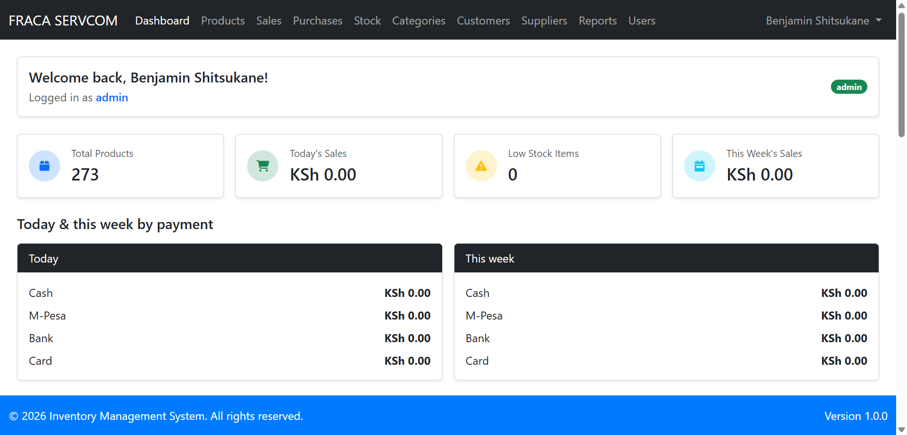
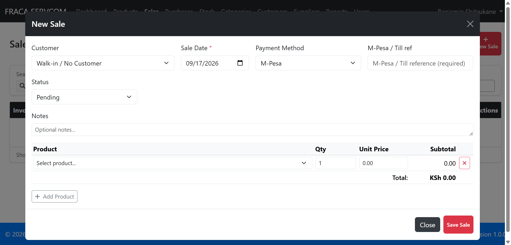
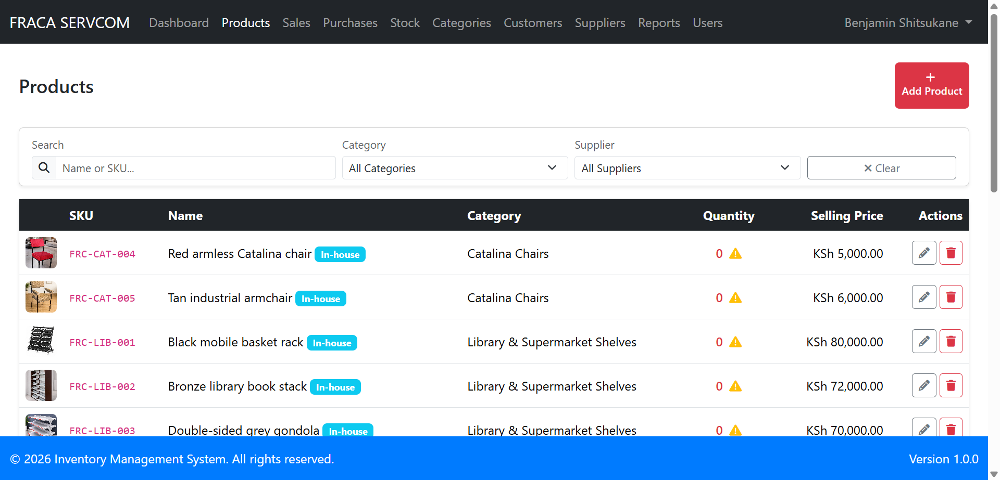

# Fraca Servcom — shop inventory

Staff-only inventory and sales book for **Fraca Servcom Ltd** in Eldoret: **furniture and bags**.

The public site ([fracaservcom.co.ke](https://fracaservcom.co.ke)) stays a catalog, WhatsApp, and contact form. An inquiry is not a sale. Reception types the sale here when the client is serious.

This started as a generic Laravel inventory project. It was rebuilt around how the shop actually works — not the other way around. It still runs locally. It is not a live hosted POS yet.

```
Website catalog  →  product list (photos, prices; stock starts at 0)
WhatsApp / form  →  Reception  →  sale in this app
```

## What it does now

- Staff login only (no public register)
- Catalog imported from the live website (~273 products)
- Stock drops only when a sale is **completed**
- Cash, M-Pesa (till reference required), bank, card
- Reception never sees cost
- Today / this week totals by payment method (for the accountant)
- Printable A4 invoice (not a KRA eTIMS tax invoice)

**Later:** quotes, deposits, VAT/eTIMS, barcode, live “in stock” on the website. Month-one goal is a trusted daily total on the shop floor.

## Screenshots

Dashboard — today’s sales split by cash / M-Pesa / bank:



New sale — walk-in, M-Pesa, till reference:



Catalog — website photos and prices, quantity still zero until they count:



## Stack

Laravel 12, PHP 8.2, Blade, Bootstrap 5, Axios, Vite. SQLite locally; MySQL (or similar) when it is hosted for the shop.

## Run it locally

Developer setup (clone, `.env`, migrate) is in [docs/local-setup.md](docs/local-setup.md). Do not copy passwords from git — set your own in `.env`.

## Docs

| File | Purpose |
|------|---------|
| [docs/local-setup.md](docs/local-setup.md) | Clone and run on your machine |
| [docs/user-manual.md](docs/user-manual.md) | How staff use the shop book |
| [docs/system-architecture.md](docs/system-architecture.md) | How the app is built |

Developer: Philip Lee. Client: Fraca Servcom Ltd.
